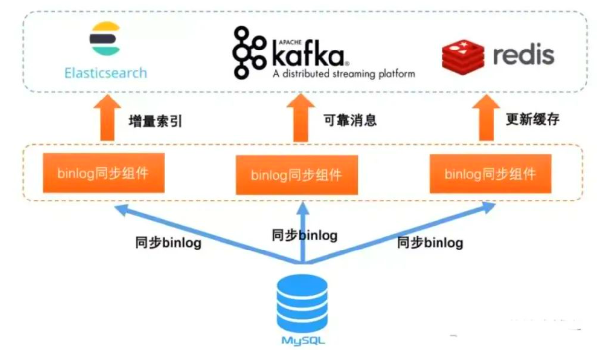
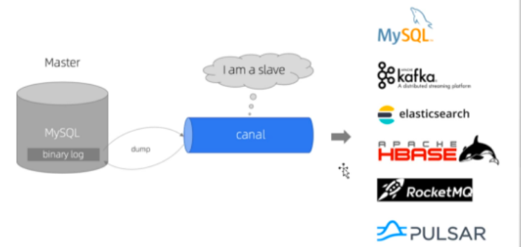

# 概述

DBA或开发人员，有时会误删或者误更新数据，如果是线上环境并且影响较大，就需要能快速回滚。传统恢复方法是利用备份重搭实例，再应用去除错误sql后的binlog来恢复数据。此法费时费力，甚至需要停机维护，并不适合快速回滚。也有团队利用LVM快照来缩短恢复时间，但快照的缺点是会影响mysql的性能。

可以通过解析MySQL的binlog来生成反向SQL来实现数据回滚


# binlog

## 概述

Mysql的Binlog是二进制格式的日志文件，Binlog是用来记录Mysql内部对数据库的改动（只记录对数据的修改操作），主要用于数据库的主从复制以及增量恢复

binlog 是 MySQL 的逻辑日志，由 Server 层记录，使用任何存储引擎都会记录binlog日志


## 作用

MySQL的作用类似于Oracle的归档日志，可以用来查看数据库的变更历史（具体的时间点所有的SQL操作）、数据库增量备份和恢复（增量备份和基于时间点的恢复）、Mysql的复制（主主数据库的复制、主从数据库的复制）

binlog 通过追加的方式写入，可以通过 `max_binlog_size` 参数配置binlog文件的大小，当文件大小达到给定的定值后，会生成新的文件来保存日志





可以使用阿里巴巴的Canal中间件来实现binLog日志监听




## 刷盘机制

对于 InnoDB 存储引擎，在事务提交后，才会记录 binlog 日志，此时日志在内存中，通过参数 sync_binlog 控制刷盘时间，sync_binlog 值有以下几种：

- 0：事务提交，不刷盘，由操作系统自行判断何时写入磁盘
- 1：每次事务提交的时候，都将 binlog 写入磁盘
- N：每 N 个事务提交，才会将 binlog 写入磁盘


## 开启binlog

首先查看mysql是否开启binlog同步功能

```sql
show variables like 'log_bin';
```


如果为on，则为开启，默认是关闭的

如果没有开启，就要编辑mysql的配置文件`my.cnf`，linux一般是在etc目录下

```sh
vi /etc/my.cnf
```


```sh
# 开启binlog
log-bin = mysql-bin
```


也可以通过 `SET SQL_LOG_BIN=1` 命令来启用 binlog，通过 `SET SQL_LOG_BIN=0` 命令停用 binlog

重启MySQL才能生效


## 相关常用命令

### 是否启用binlog日志

```sql
show variables like 'log_bin';
```


### 查看详细的binlog日志配置信息

```sql
show global variables like '%log%';
```


```sh
mysql> show global variables like '%log%';
+------------------------------------------------+----------------------------------------------------------------+
| Variable_name                                  | Value                                                          |
+------------------------------------------------+----------------------------------------------------------------+
| activate_all_roles_on_login                    | OFF                                                            |
| back_log                                       | 151                                                            |
| binlog_cache_size                              | 32768                                                          |
| binlog_checksum                                | CRC32                                                          |
| binlog_direct_non_transactional_updates        | OFF                                                            |
| binlog_encryption                              | OFF                                                            |
| binlog_error_action                            | ABORT_SERVER                                                   |
| binlog_expire_logs_auto_purge                  | ON                                                             |
| binlog_expire_logs_seconds                     | 2592000                                                        |
| binlog_format                                  | ROW                                                            |
| binlog_group_commit_sync_delay                 | 0                                                              |
| binlog_group_commit_sync_no_delay_count        | 0                                                              |
| binlog_gtid_simple_recovery                    | ON                                                             |
| binlog_max_flush_queue_time                    | 0                                                              |
| binlog_order_commits                           | ON                                                             |
| binlog_rotate_encryption_master_key_at_startup | OFF                                                            |
| binlog_row_event_max_size                      | 8192                                                           |
| binlog_row_image                               | FULL                                                           |
| binlog_row_metadata                            | MINIMAL                                                        |
| binlog_row_value_options                       |                                                                |
| binlog_rows_query_log_events                   | OFF                                                            |
| binlog_stmt_cache_size                         | 32768                                                          |
| binlog_transaction_compression                 | OFF                                                            |
| binlog_transaction_compression_level_zstd      | 3                                                              |
| binlog_transaction_dependency_history_size     | 25000                                                          |
| binlog_transaction_dependency_tracking         | COMMIT_ORDER                                                   |
| expire_logs_days                               | 0                                                              |
| general_log                                    | OFF                                                            |
| general_log_file                               | MAO.log                                                        |
| innodb_api_enable_binlog                       | OFF                                                            |
| innodb_flush_log_at_timeout                    | 1                                                              |
| innodb_flush_log_at_trx_commit                 | 1                                                              |
| innodb_log_buffer_size                         | 16777216                                                       |
| innodb_log_checksums                           | ON                                                             |
| innodb_log_compressed_pages                    | ON                                                             |
| innodb_log_file_size                           | 50331648                                                       |
| innodb_log_files_in_group                      | 2                                                              |
| innodb_log_group_home_dir                      | .\                                                             |
| innodb_log_spin_cpu_abs_lwm                    | 80                                                             |
| innodb_log_spin_cpu_pct_hwm                    | 50                                                             |
| innodb_log_wait_for_flush_spin_hwm             | 400                                                            |
| innodb_log_write_ahead_size                    | 8192                                                           |
| innodb_log_writer_threads                      | ON                                                             |
| innodb_max_undo_log_size                       | 1073741824                                                     |
| innodb_online_alter_log_max_size               | 134217728                                                      |
| innodb_print_ddl_logs                          | OFF                                                            |
| innodb_redo_log_archive_dirs                   |                                                                |
| innodb_redo_log_capacity                       | 104857600                                                      |
| innodb_redo_log_encrypt                        | OFF                                                            |
| innodb_undo_log_encrypt                        | OFF                                                            |
| innodb_undo_log_truncate                       | ON                                                             |
| log_bin                                        | ON                                                             |
| log_bin_basename                               | C:\ProgramData\MySQL\MySQL Server 8.0\Data\MAO-bin             |
| log_bin_index                                  | C:\ProgramData\MySQL\MySQL Server 8.0\Data\MAO-bin.index       |
| log_bin_trust_function_creators                | OFF                                                            |
| log_bin_use_v1_row_events                      | OFF                                                            |
| log_error                                      | .\MAO.err                                                      |
| log_error_services                             | log_filter_internal; log_sink_internal                         |
| log_error_suppression_list                     |                                                                |
| log_error_verbosity                            | 2                                                              |
| log_output                                     | FILE                                                           |
| log_queries_not_using_indexes                  | OFF                                                            |
| log_raw                                        | OFF                                                            |
| log_replica_updates                            | ON                                                             |
| log_slave_updates                              | ON                                                             |
| log_slow_admin_statements                      | OFF                                                            |
| log_slow_extra                                 | OFF                                                            |
| log_slow_replica_statements                    | OFF                                                            |
| log_slow_slave_statements                      | OFF                                                            |
| log_statements_unsafe_for_binlog               | ON                                                             |
| log_throttle_queries_not_using_indexes         | 0                                                              |
| log_timestamps                                 | UTC                                                            |
| max_binlog_cache_size                          | 18446744073709547520                                           |
| max_binlog_size                                | 1073741824                                                     |
| max_binlog_stmt_cache_size                     | 18446744073709547520                                           |
| max_relay_log_size                             | 0                                                              |
| relay_log                                      | mao-relay-bin                                                  |
| relay_log_basename                             | C:\ProgramData\MySQL\MySQL Server 8.0\Data\mao-relay-bin       |
| relay_log_index                                | C:\ProgramData\MySQL\MySQL Server 8.0\Data\mao-relay-bin.index |
| relay_log_info_file                            | relay-log.info                                                 |
| relay_log_info_repository                      | TABLE                                                          |
| relay_log_purge                                | ON                                                             |
| relay_log_recovery                             | OFF                                                            |
| relay_log_space_limit                          | 0                                                              |
| slow_query_log                                 | ON                                                             |
| slow_query_log_file                            | MAO-slow.log                                                   |
| sql_log_off                                    | OFF                                                            |
| sync_binlog                                    | 1                                                              |
| sync_relay_log                                 | 10000                                                          |
| sync_relay_log_info                            | 10000                                                          |
| terminology_use_previous                       | NONE                                                           |
+------------------------------------------------+----------------------------------------------------------------+
91 rows in set, 1 warning (0.00 sec)

mysql>
```


### 查看binlog的目录

```sql
show global variables like "%log_bin%";
```


```sh
mysql> show global variables like "%log_bin%";
+---------------------------------+----------------------------------------------------------+
| Variable_name                   | Value                                                    |
+---------------------------------+----------------------------------------------------------+
| log_bin                         | ON                                                       |
| log_bin_basename                | C:\ProgramData\MySQL\MySQL Server 8.0\Data\MAO-bin       |
| log_bin_index                   | C:\ProgramData\MySQL\MySQL Server 8.0\Data\MAO-bin.index |
| log_bin_trust_function_creators | OFF                                                      |
| log_bin_use_v1_row_events       | OFF                                                      |
+---------------------------------+----------------------------------------------------------+
5 rows in set, 1 warning (0.00 sec)

mysql>
```


### 查看binlog文件日志列表

```sql
show binary logs;
```


```sh
mysql> show binary logs;
+----------------+-----------+-----------+
| Log_name       | File_size | Encrypted |
+----------------+-----------+-----------+
| MAO-bin.000650 | 170403208 | No        |
| MAO-bin.000651 |       180 | No        |
| MAO-bin.000652 |       180 | No        |
| MAO-bin.000653 |       180 | No        |
| MAO-bin.000654 |       180 | No        |
| MAO-bin.000655 |       180 | No        |
| MAO-bin.000656 |       368 | No        |
| MAO-bin.000657 |  21002124 | No        |
| MAO-bin.000658 |       180 | No        |
| MAO-bin.000659 |       180 | No        |
| MAO-bin.000660 |   7909038 | No        |
| MAO-bin.000661 |  25635575 | No        |
| MAO-bin.000662 |   1839935 | No        |
| MAO-bin.000663 |     13990 | No        |
| MAO-bin.000664 | 914604165 | No        |
+----------------+-----------+-----------+
15 rows in set (0.03 sec)

mysql>
```


###  查看最新一个binlog日志文件名称和Position

```sql
show master status;
```


```sh
mysql> show master status;
+----------------+-----------+--------------+------------------+-------------------+
| File           | Position  | Binlog_Do_DB | Binlog_Ignore_DB | Executed_Gtid_Set |
+----------------+-----------+--------------+------------------+-------------------+
| MAO-bin.000664 | 914604165 |              |                  |                   |
+----------------+-----------+--------------+------------------+-------------------+
1 row in set (0.00 sec)

mysql>
```


### 刷新log日志

自此刻开始产生一个新编号的binlog日志文件，每当mysqld服务重启时，会自动执行此命令，刷新binlog日志；在mysqldump备份数据时加 -F 选项也会刷新binlog日志

```sql
flush logs;
```


### 查看第一个binlog文件内容

```sql
show binlog events;
```


内容太多，不展示


### 查看具体一个binlog文件的内容

```sql
show binlog events in 'xxx.00000x';
```


### 清空所有binlog日志

```sql
reset master;
```


### 删除slave的中继日志

```sql
reset slave;
```


### 删除指定日期前的日志索引中binlog日志文件

```sql
purge master logs before 'yyyy-MM-dd HH:mm:ss';
```


### 删除指定日志文件

```sql
purge master logs to 'master.000001';
```


## 找到binlog日志

使用`show global variables like '%log%';`命令，根据`log_bin_basename`参数的值来寻找binlog日志的位置

```sh
PS C:\ProgramData\MySQL\MySQL Server 8.0\Data> pwd

Path
----
C:\ProgramData\MySQL\MySQL Server 8.0\Data


PS C:\ProgramData\MySQL\MySQL Server 8.0\Data> ls


    目录: C:\ProgramData\MySQL\MySQL Server 8.0\Data


Mode                 LastWriteTime         Length Name
----                 -------------         ------ ----
d-----         2023/9/28      9:04                #innodb_redo
d-----         2023/9/26     22:25                #innodb_temp
d-----          2023/9/9     21:11                activiti
d-----         2023/2/14     22:48                aggregate_pay_log
d-----         2023/2/14     22:48                aggregate_pay_merchant_service
d-----         2023/5/19     23:13                aggregate_pay_merchant_service1
d-----         2023/2/14     22:48                aggregate_pay_transaction
d-----         2023/5/19     23:13                aggregate_pay_transaction1
d-----         2023/2/14     22:48                aggregate_pay_uaa
d-----         2023/2/14     22:48                aggregate_pay_user
d-----         2023/5/19     20:08                authority
d-----         2023/4/13     13:13                chat_room
d-----         2023/2/14     22:48                cloud_order
d-----         2023/2/14     22:48                cloud_user
d-----         2023/9/11     14:54                datart
d-----         2023/4/14     21:10                epms
d-----         2023/9/28      8:59                gzepi
d-----         2023/9/28     17:34                gzepi_wdst
d-----         2023/2/14     22:48                hotel
d-----         2023/8/28     10:26                jxstar_cloud
d-----         2023/8/28     13:09                jxstar_cloud1
d-----         2023/4/19     20:38                library_seat_selection
d-----         2023/2/15     22:07                mysql
d-----          2023/5/3     23:49                nacos
d-----         2023/2/15     22:07                performance_schema
d-----         2023/2/14     22:48                sakila
d-----         2023/2/14     22:48                seata
d-----         2023/2/14     22:48                seata_demo
d-----          2023/5/3     23:56                shop
d-----         2023/5/20     21:32                sms
d-----         2023/5/20     21:34                sms1
d-----         2023/2/14     22:48                spring_cloud_security
d-----         2023/2/26     14:46                ssmf51qm
d-----         2023/2/14     22:48                student
d-----          2023/5/3     23:57                student1
d-----         2023/2/14     22:48                student_test
d-----         2023/2/14     22:48                sys
d-----          2023/4/9     23:37                test
d-----          2023/9/6     15:04                test2
d-----          2023/9/5     10:07                test3
d-----          2023/5/8     22:24                tmalldemodb
d-----         2023/2/14     22:48                tx
d-----         2023/2/14     22:48                world
-a----         2023/9/29     19:48         196608 #ib_16384_0.dblwr
-a----         2023/9/28      9:04        8585216 #ib_16384_1.dblwr
-a----        2021/11/24     16:56             56 auto.cnf
-a----        2021/11/24     16:56           1680 ca-key.pem
-a----        2021/11/24     16:56           1112 ca.pem
-a----        2021/11/24     16:56           1112 client-cert.pem
-a----        2021/11/24     16:56           1680 client-key.pem
-a----         2023/9/29     19:46       12582912 ibdata1
-a----         2023/9/26     22:26       12582912 ibtmp1
-a----         2023/9/26     22:24           5916 ib_buffer_pool
-a----         2023/8/29      8:50      170403208 MAO-bin.000650
-a----         2023/8/30     16:25            180 MAO-bin.000651
-a----         2023/8/30     19:53            180 MAO-bin.000652
-a----         2023/8/30     19:55            180 MAO-bin.000653
-a----         2023/8/30     19:57            180 MAO-bin.000654
-a----          2023/9/5      8:54            180 MAO-bin.000655
-a----          2023/9/5     16:38            368 MAO-bin.000656
-a----         2023/9/13     17:42       21002124 MAO-bin.000657
-a----         2023/9/14      9:01            180 MAO-bin.000658
-a----         2023/9/14      9:04            180 MAO-bin.000659
-a----         2023/9/14     15:13        7909038 MAO-bin.000660
-a----         2023/9/15     21:18       25635575 MAO-bin.000661
-a----         2023/9/17     16:33        1839935 MAO-bin.000662
-a----         2023/9/26     22:24          13990 MAO-bin.000663
-a----         2023/9/28     17:34      914604165 MAO-bin.000664
-a----         2023/9/26     22:25            255 MAO-bin.index
-a----         2023/9/26     22:25         131062 MAO-slow.log
-a----         2023/9/28     17:09        1346649 MAO.err
-a----         2023/9/26     22:25              5 mao.pid
-a----         2023/9/29     19:46       50331648 mysql.ibd
-a----         2023/2/15     22:07              6 mysql_upgrade_info
-a----        2021/11/24     16:56           1676 private_key.pem
-a----        2021/11/24     16:56            452 public_key.pem
-a----        2021/11/24     16:56           1112 server-cert.pem
-a----        2021/11/24     16:56           1676 server-key.pem
-a----         2023/9/29     19:43       16777216 undo_001
-a----         2023/9/29     19:48      100663296 undo_002


PS C:\ProgramData\MySQL\MySQL Server 8.0\Data>
```


```sh
PS C:\ProgramData\MySQL\MySQL Server 8.0\Data> cat .\MAO-bin.index
.\MAO-bin.000650
.\MAO-bin.000651
.\MAO-bin.000652
.\MAO-bin.000653
.\MAO-bin.000654
.\MAO-bin.000655
.\MAO-bin.000656
.\MAO-bin.000657
.\MAO-bin.000658
.\MAO-bin.000659
.\MAO-bin.000660
.\MAO-bin.000661
.\MAO-bin.000662
.\MAO-bin.000663
.\MAO-bin.000664
PS C:\ProgramData\MySQL\MySQL Server 8.0\Data>
```


## 解析binlog日志

binlog是二进制文件，普通文件查看器cat more vi等都无法打开，必须使用官方自带的 mysqlbinlog 命令查看


参数如下：

```sh
Usage: C:\Program Files\MySQL\MySQL Server 8.0\bin\mysqlbinlog.exe [options] log-files
  -?, --help          Display this help and exit.
  --base64-output=name
                      Determine when the output statements should be
                      base64-encoded BINLOG statements: 'never' disables it and
                      works only for binlogs without row-based events;
                      'decode-rows' decodes row events into commented
                      pseudo-SQL statements if the --verbose option is also
                      given; 'auto' prints base64 only when necessary (i.e.,
                      for row-based events and format description events).  If
                      no --base64-output[=name] option is given at all, the
                      default is 'auto'.
  --bind-address=name IP address to bind to.
  --character-sets-dir=name
                      Directory for character set files.
  -d, --database=name List entries for just this database (local log only).
  --rewrite-db=name   Rewrite the row event to point so that it can be applied
                      to a new database
  -#, --debug[=#]     This is a non-debug version. Catch this and exit.
  --debug-check       This is a non-debug version. Catch this and exit.
  --debug-info        This is a non-debug version. Catch this and exit.
  --default-auth=name Default authentication client-side plugin to use.
  -D, --disable-log-bin
                      Disable binary log. This is useful, if you enabled
                      --to-last-log and are sending the output to the same
                      MySQL server. This way you could avoid an endless loop.
                      You would also like to use it when restoring after a
                      crash to avoid duplication of the statements you already
                      have. NOTE: you will need a SUPER privilege to use this
                      option.
  -F, --force-if-open Force if binlog was not closed properly.
                      (Defaults to on; use --skip-force-if-open to disable.)
  -f, --force-read    Force reading unknown binlog events.
  -H, --hexdump       Augment output with hexadecimal and ASCII event dump.
  -h, --host=name     Get the binlog from server.
  -i, --idempotent    Notify the server to use idempotent mode before applying
                      Row Events
  -l, --local-load=name
                      Prepare local temporary files for LOAD DATA INFILE in the
                      specified directory.
  -o, --offset=#      Skip the first N entries.
  -p, --password[=name]
                      Password to connect to remote server.
  --plugin-dir=name   Directory for client-side plugins.
  -P, --port=#        Port number to use for connection or 0 for default to, in
                      order of preference, my.cnf, $MYSQL_TCP_PORT,
                      /etc/services, built-in default (3306).
  --protocol=name     The protocol to use for connection (tcp, socket, pipe,
                      memory).
  -R, --read-from-remote-server
                      Read binary logs from a MySQL server. This is an alias
                      for read-from-remote-source=BINLOG-DUMP-NON-GTIDS.
  --read-from-remote-master=name
                      This option is deprecated and will be removed in a future
                      version. Use read-from-remote-source instead.
  --read-from-remote-source=name
                      Read binary logs from a MySQL server through the
                      COM_BINLOG_DUMP or COM_BINLOG_DUMP_GTID commands by
                      setting the option to either BINLOG-DUMP-NON-GTIDS or
                      BINLOG-DUMP-GTIDS, respectively. If
                      --read-from-remote-source=BINLOG-DUMP-GTIDS is combined
                      with --exclude-gtids, transactions are filtered out on
                      the source, to avoid unnecessary network traffic.
  --raw               Requires -R. Output raw binlog data instead of SQL
                      statements, output is to log files.
  -r, --result-file=name
                      Direct output to a given file. With --raw this is a
                      prefix for the file names.
  --server-id=#       Extract only binlog entries created by the server having
                      the given id.
  --server-id-bits=#  Set number of significant bits in server-id
  --set-charset=name  Add 'SET NAMES character_set' to the output.
  --shared-memory-base-name=name
                      Base name of shared memory.
  -s, --short-form    Just show regular queries: no extra info and no row-based
                      events. This is for testing only, and should not be used
                      in production systems. If you want to suppress
                      base64-output, consider using --base64-output=never
                      instead.
  -S, --socket=name   The socket file to use for connection.
  --server-public-key-path=name
                      File path to the server public RSA key in PEM format.
  --get-server-public-key
                      Get server public key
  --ssl-mode=name     SSL connection mode.
  --ssl-ca=name       CA file in PEM format.
  --ssl-capath=name   CA directory.
  --ssl-cert=name     X509 cert in PEM format.
  --ssl-cipher=name   SSL cipher to use.
  --ssl-key=name      X509 key in PEM format.
  --ssl-crl=name      Certificate revocation list.
  --ssl-crlpath=name  Certificate revocation list path.
  --tls-version=name  TLS version to use, permitted values are: TLSv1.2,
                      TLSv1.3
  --ssl-fips-mode=name
                      SSL FIPS mode (applies only for OpenSSL); permitted
                      values are: OFF, ON, STRICT
  --tls-ciphersuites=name
                      TLS v1.3 cipher to use.
  --ssl-session-data=name
                      Session data file to use to enable ssl session reuse
  --ssl-session-data-continue-on-failed-reuse
                      If set to ON, this option will allow connection to
                      succeed even if session data cannot be reused.
  --start-datetime=name
                      Start reading the binlog at first event having a datetime
                      equal or posterior to the argument; the argument must be
                      a date and time in the local time zone, in any format
                      accepted by the MySQL server for DATETIME and TIMESTAMP
                      types, for example: 2004-12-25 11:25:56 (you should
                      probably use quotes for your shell to set it properly).
  -j, --start-position=#
                      Start reading the binlog at position N. Applies to the
                      first binlog passed on the command line.
  --stop-datetime=name
                      Stop reading the binlog at first event having a datetime
                      equal or posterior to the argument; the argument must be
                      a date and time in the local time zone, in any format
                      accepted by the MySQL server for DATETIME and TIMESTAMP
                      types, for example: 2004-12-25 11:25:56 (you should
                      probably use quotes for your shell to set it properly).
  --stop-never        Wait for more data from the server instead of stopping at
                      the end of the last log. Implicitly sets --to-last-log
                      but instead of stopping at the end of the last log it
                      continues to wait till the server disconnects.
  --stop-never-slave-server-id=#
                      The server_id that is reported when connecting to a
                      source server when using --read-from-remote-server
                      --stop-never. This option is deprecated and will be
                      removed in a future version. Use connection-server-id
                      instead.
  --connection-server-id=#
                      The server_id that will be reported when connecting to a
                      source server when using --read-from-remote-server. This
                      option cannot be used together with
                      stop-never-slave-server-id.
  --stop-position=#   Stop reading the binlog at position N. Applies to the
                      last binlog passed on the command line.
  -t, --to-last-log   Requires -R. Will not stop at the end of the requested
                      binlog but rather continue printing until the end of the
                      last binlog of the MySQL server. If you send the output
                      to the same MySQL server, that may lead to an endless
                      loop.
  -u, --user=name     Connect to the remote server as username.
  -v, --verbose       Reconstruct pseudo-SQL statements out of row events. -v
                      -v adds comments on column data types.
  -V, --version       Print version and exit.
  --open-files-limit=#
                      Used to reserve file descriptors for use by this program.
  -c, --verify-binlog-checksum
                      Verify checksum binlog events.
  --binlog-row-event-max-size=#
                      The maximum size of a row-based binary log event in
                      bytes. Rows will be grouped into events smaller than this
                      size if possible. This value must be a multiple of 256.
  --skip-gtids        Do not preserve Global Transaction Identifiers; instead
                      make the server execute the transactions as if they were
                      new.
  --include-gtids=name
                      Print events whose Global Transaction Identifiers were
                      provided.
  --exclude-gtids=name
                      Print all events but those whose Global Transaction
                      Identifiers were provided.
  --print-table-metadata
                      Print metadata stored in Table_map_log_event
  -C, --compress      Use compression in server/client protocol.
  --compression-algorithms=name
                      Use compression algorithm in server/client protocol.
                      Valid values are any combination of
                      'zstd','zlib','uncompressed'.
  --zstd-compression-level=#
                      Use this compression level in the client/server protocol,
                      in case --compression-algorithms=zstd. Valid range is
                      between 1 and 22, inclusive. Default is 3.
  --require-row-format
                      Fail when printing an event that was not logged using row
                      format or other forbidden events like Load instructions
                      or the creation/deletion of temporary tables.

Default options are read from the following files in the given order:
C:\Windows\my.ini C:\Windows\my.cnf C:\my.ini C:\my.cnf C:\Program Files\MySQL\MySQL Server 8.0\my.ini C:\Program Files\MySQL\MySQL Server 8.0\my.cnf
The following groups are read: mysqlbinlog client
The following options may be given as the first argument:
--print-defaults        Print the program argument list and exit.
--no-defaults           Don't read default options from any option file,
                        except for login file.
--defaults-file=#       Only read default options from the given file #.
--defaults-extra-file=# Read this file after the global files are read.
--defaults-group-suffix=#
                        Also read groups with concat(group, suffix)
--login-path=#          Read this path from the login file.
```


命令：

```sh
mysqlbinlog --no-defaults --base64-output=DECODE-ROWS -v ./MAO-bin.000664 >000664.txt
```


备份内容参考：

```sh
### INSERT INTO `test`.`test`
### SET
###   @1=1 /* INT meta=0 nullable=0 is_null=0 */
###   @2=501885 /* INT meta=0 nullable=0 is_null=0 */
###   @3='08566691963-88624912351-16662227201-46648573979-64646226163-77505759394-75470094713-41097360717-15161106334-50535565977' /* STRING(480) meta=61152 nullable=0 is_null=0 */
###   @4='63188288836-92351140030-06390587585-66802097351-49282961843' /* STRING(240) meta=65264 nullable=0 is_null=0 */
### INSERT INTO `test`.`test`
### SET
###   @1=2 /* INT meta=0 nullable=0 is_null=0 */
###   @2=495688 /* INT meta=0 nullable=0 is_null=0 */
###   @3='95969429576-20587925969-20202408199-67602281819-18293380360-38184587501-73192830026-41693404212-56705243222-89212376805' /* STRING(480) meta=61152 nullable=0 is_null=0 */
###   @4='09512147864-77936258834-40901700703-13541171421-15205431759' /* STRING(240) meta=65264 nullable=0 is_null=0 */
### INSERT INTO `test`.`test`
### SET
###   @1=3 /* INT meta=0 nullable=0 is_null=0 */
###   @2=514246 /* INT meta=0 nullable=0 is_null=0 */
###   @3='26283585383-48610978532-72166636310-67148386979-89643583984-06169170732-23477134062-17788128188-73465768032-24619558652' /* STRING(480) meta=61152 nullable=0 is_null=0 */
###   @4='21979564480-87492594656-60524686334-78820761788-57684966682' /* STRING(240) meta=65264 nullable=0 is_null=0 */
### INSERT INTO `test`.`test`
### SET
###   @1=4 /* INT meta=0 nullable=0 is_null=0 */
###   @2=393975 /* INT meta=0 nullable=0 is_null=0 */
###   @3='57481185690-89398636500-16888148413-67987678267-15604944838-94210794401-18107184012-91338377776-83386272438-09451188763' /* STRING(480) meta=61152 nullable=0 is_null=0 */
###   @4='35227182905-15234265621-59793845249-15413569710-23749555118' /* STRING(240) meta=65264 nullable=0 is_null=0 */
### INSERT INTO `test`.`test`
### SET
###   @1=5 /* INT meta=0 nullable=0 is_null=0 */
###   @2=500775 /* INT meta=0 nullable=0 is_null=0 */
###   @3='93482034638-51911042233-95872637268-17943401357-38175578085-45788017606-44041118775-54344399763-72128807465-92228972632' /* STRING(480) meta=61152 nullable=0 is_null=0 */
###   @4='27590239742-20204899609-34345212327-79811525340-24267764271' /* STRING(240) meta=65264 nullable=0 is_null=0 */
### INSERT INTO `test`.`test`
### SET
###   @1=6 /* INT meta=0 nullable=0 is_null=0 */
###   @2=498573 /* INT meta=0 nullable=0 is_null=0 */
###   @3='24310225777-93998284033-46606859421-56148834010-17759122961-78348472702-44986564036-71625391482-12661762212-64721022134' /* STRING(480) meta=61152 nullable=0 is_null=0 */
###   @4='43131080328-59298106536-35954612339-97546855884-75769514803' /* STRING(240) meta=65264 nullable=0 is_null=0 */
### INSERT INTO `test`.`test`
### SET
###   @1=7 /* INT meta=0 nullable=0 is_null=0 */
###   @2=504353 /* INT meta=0 nullable=0 is_null=0 */
###   @3='70862277183-86122137003-79729847560-50337161750-15964469011-48879357028-22541966759-10928901419-99400098250-19200948263' /* STRING(480) meta=61152 nullable=0 is_null=0 */
###   @4='00505722282-72931248925-57037623248-81117963809-88658076981' /* STRING(240) meta=65264 nullable=0 is_null=0 */
### INSERT INTO `test`.`test`
### SET
###   @1=8 /* INT meta=0 nullable=0 is_null=0 */
###   @2=497896 /* INT meta=0 nullable=0 is_null=0 */
###   @3='82571936845-31830426410-85662298479-28456275464-64339136268-26186841165-94168712814-56389105006-66969794071-60071049942' /* STRING(480) meta=61152 nullable=0 is_null=0 */
###   @4='13152283289-69561545685-52868757241-04245213425-69280254356' /* STRING(240) meta=65264 nullable=0 is_null=0 */
### INSERT INTO `test`.`test`
### SET
###   @1=9 /* INT meta=0 nullable=0 is_null=0 */
###   @2=503666 /* INT meta=0 nullable=0 is_null=0 */
###   @3='30259457399-49455699717-43210898264-46300466148-34254750860-44098710066-38295952016-90196077385-22332519290-06484158548' /* STRING(480) meta=61152 nullable=0 is_null=0 */
###   @4='40929980986-33813039690-13155419391-97985458477-39771362212' /* STRING(240) meta=65264 nullable=0 is_null=0 */
### INSERT INTO `test`.`test`
### SET
###   @1=10 /* INT meta=0 nullable=0 is_null=0 */
###   @2=503330 /* INT meta=0 nullable=0 is_null=0 */
###   @3='48090103407-09222928184-34050945574-85418069333-36966673537-23363106719-15284068881-04674238815-26203696337-24037044694' /* STRING(480) meta=61152 nullable=0 is_null=0 */
###   @4='01495266405-82925129145-92643983850-90243995398-18709399387' /* STRING(240) meta=65264 nullable=0 is_null=0 */
```


## 格式

binlog 有三种格式，分为 STATEMENT，ROW 和 MIXED：

* **statement**：基于SQL语句的模式，binlog数据量小，但是某些语句和函数在复制过程可能导致数据不一致甚至出错
* **row**：基于行的模式，记录的是行的完整变化。很安全，但是binlog会比其他两种模式大很多
* **mixed**：混合模式，根据语句来选用是statement还是row模式


### statement

Statement 模式只记录执行的 SQL，不需要记录每一行数据的变化，因此极大的减少了 binlog 的日志量，避免了大量的 IO 操作，提升了系统的性能

但是，正是由于 Statement 模式只记录 SQL，而如果一些 SQL 中 包含了函数，那么可能会出现执行结果不一致的情况。比如说 uuid() 函数，每次执行的时候都会生成一个随机字符串，在 master 中记录了 uuid，当同步到 slave 之后，再次执行，就得到另外一个结果了

所以使用 Statement 格式会出现一些数据一致性问题


### row

从 MySQL5.1.5 版本开始，binlog 引入了 Row 格式

Row 格式的日志内容会非常清楚地记录下每一行数据修改的细节，这样就不会出现 Statement 中存在的那种数据无法被正常复制的情况


### mixed

从 MySQL5.1.8 版开始，MySQL 又推出了 Mixed 格式，这种格式实际上就是 Statement 与 Row 的结合

在 Mixed 模式下，系统会自动判断该用 Statement 还是 Row

Mixed 模式中，MySQL 会根据执行的每一条具体的 SQL 语句来区别对待记录的日志格式，也就是在 Statement 和 Row 之间选择一种

一般的语句修改使用 Statement 格式保存 binlog；对于一些 Statement 无法准确完成主从复制的操作，则采用 Row 格式保存 binlog


### statement优缺点

- 优点：不需要记录每一行的变化，减少了 binlog 日志量，节约IO，从而提高性能。
- 缺点：在某些情况下会导致主从数据不一致，比如执行 sysdate()，slepp()


### row优缺点

- 优点：不会出现某些特定情况下的存储过程、或function、或trigger的调用和触发无法被正确复制的问题
- 缺点：会产生大量的日志


## binlog_row_image

binlog_row_image是一个很重要但又容易被忽略的参数。binlog_row_image参数，决定了binlog是如何记录前镜像和后镜像的，这也就会直接影响到数据闪回、主从复制等

binlog_row_image参数，只在row模式下生效


### 前镜像和后镜像

* 前镜像(before image)：记录修改前的内容
* 后镜像(after image)：记录修改后的内容


### 取值

它有三个取值：`FULL`、`MINIMAL`和`NOBLOB`，默认取值是`FULL`

* binlog_row_image为`FULL`时，表无论有没有主键约束或者唯一约束binlog都会记录所有前后镜像
* binlog_row_image为`MINIMAL`时，如果表有主键或唯一索引，前镜像只保留主键列，后镜像只保留修改列；如果表没有主键或唯一索引，前镜像全保留，后镜像只保留修改列
* binlog_row_image为NOBLOB时，如果表有主键或唯一索引，修改列为text/blob列，前镜像忽略text/blob列，后镜像包含被修改的text/blob列；如果表有主键或唯一索引，修改列不是text/blob列，前后镜像忽略text/blob列。如果表没有主键或唯一索引，修改列为text/blob列 ，前后镜像全保留；如果表没有主键或唯一索引，修改列不是text/blob列，前镜像全保留，后镜像忽略text/blob列


### binlog的区别

三者取值不同，binlog会有一定的区别


#### FULL

##### 有主键约束

```sql
CREATE TABLE 'test1' (
    'id' int(11) NOT NULL,
    'name' varchar(10) DEFAULT NULL,
    primary key('id')
);

INSERT into test1 values(1,'jack'),(2,'mary');

UPDATE test1 SET name='bob' WHERE id=2;
```


使用mysqlbinlog解析binlog，得到的记录镜像信息如下：

```sh
### UPDATE 'test1','test1'
### WHERE
###	  @1=2
###   @2='mary'
### SET
###   @1=2
###   @2='bob'
```


更新记录的前后镜像所有字段都记录了


##### 无主键约束

```sql
CREATE TABLE 'test2' (
	'id' int(11) DEFAULT NULL,
    'name' varchar(10) DEFAULT NULL
);

INSERT into test2 values(1,'bob'),(2,'chang');

UPDATE test2 SET name='jack' WHERE id=2;
```


```sh
### UPDATE 'test','test2'
### WHERE
###	  @1=2
###   @2='chang'
### SET
###   @1=2
###   @2='jack'
```


更新记录的前后镜像所有字段都记录了


#### MINIMAL

##### 有主键约束

```sql
CREATE TABLE 'test1' (
    'id' int(11) NOT NULL,
    'name' varchar(10) DEFAULT NULL,
    primary key('id')
);

INSERT into test1 values(1,'jack'),(2,'mary');

UPDATE test1 SET name='bob' WHERE id=2;
```


```sh
### UPDATE 'test','test1'
### WHERE
###	  @1=2
### SET
###   @2='bob'
```


如果表有主键或唯一索引，前镜像只保留主键列，后镜像只保留修改列


##### 无主键约束

```sql
CREATE TABLE 'test2' (
	'id' int(11) DEFAULT NULL,
    'name' varchar(10) DEFAULT NULL
);

INSERT into test2 values(1,'bob'),(2,'chang');

UPDATE test2 SET name='jack' WHERE id=2;
```


```sh
### UPDATE 'test','test2'
### WHERE
###	  @1=1
###   @2='chang'
### SET
###   @2='jack'
```


如果表没有主键或唯一索引，前镜像全保留，后镜像只保留修改列


#### NOBLOB

##### 有主键约束并更新text/blob列

```sql
CREATE TABLE 'test1' (
    'id' int(11) NOT NULL,
    'name' text,
    'address' varchar(20) DEFAULT NULL,
    PRIMARY kEY ('id')
);

INSERT into test1 values(1,'jack','Japen'),(2,'bob','China');

UPDATE test1 SET name='mary' WHERE id=1;
```


```sh
### UPDATE 'test','test1'
### WHERE
###	  @1=1
###   @3='Japen'
### SET
###   @1=1
###   @2='mary'
###   @3='Japen'
```


如果表有主键或唯一索引，修改列为text/blob列，前镜像忽略text/blob列，后镜像包含被修改的text/blob列


##### 有主键约束并更新非text/blob列

```sql
UPDATE test1 SET address='Japen2' WHERE id=1;
```


```sh
### UPDATE 'test','test1'
### WHERE
###	  @1=1
###   @3='Japen'
### SET
###   @1=1
###   @3='Japen2'
```


如果表没有主键或唯一索引，修改的列不是text/blob列，则前后镜像都忽略text/blob列


##### 无主键约束并更新text/blob列

```sql
CREATE TABLE 'test2' (
    'id' int(11) NOT NULL,
    'name' text DEFAULT NULL,
    'address' varchar(20) DEFAULT NULL
);

INSERT into test2 values(1,'jack','Japen'),(2,'bob','China');

UPDATE test2 SET name='mary' WHERE id=1;
```


```sh
### UPDATE 'test','test1'
### WHERE
###	  @1=1
###   @2='jack'
###   @3='Japen'
### SET
###   @1=1
###   @2='mary'
###   @3='Japen'
```


如果表没有主键或唯一索引，修改列为text/blob列，前后镜像全都保留


##### 无主键约束并更新非text/blob列

```sql
UPDATE test2 SET address='Japen2' WHERE id=1;
```


```sh
### UPDATE 'test','test2'
### WHERE
###	  @1=1
###   @2='mary'
###   @3='Japen'
### SET
###   @1=1
###   @3='Japen2'
```


如果表没有主键或唯一索引，修改列不是text/blob列，则前镜像全保留，后镜像忽略text/blob列


# 数据闪回

## 概述

