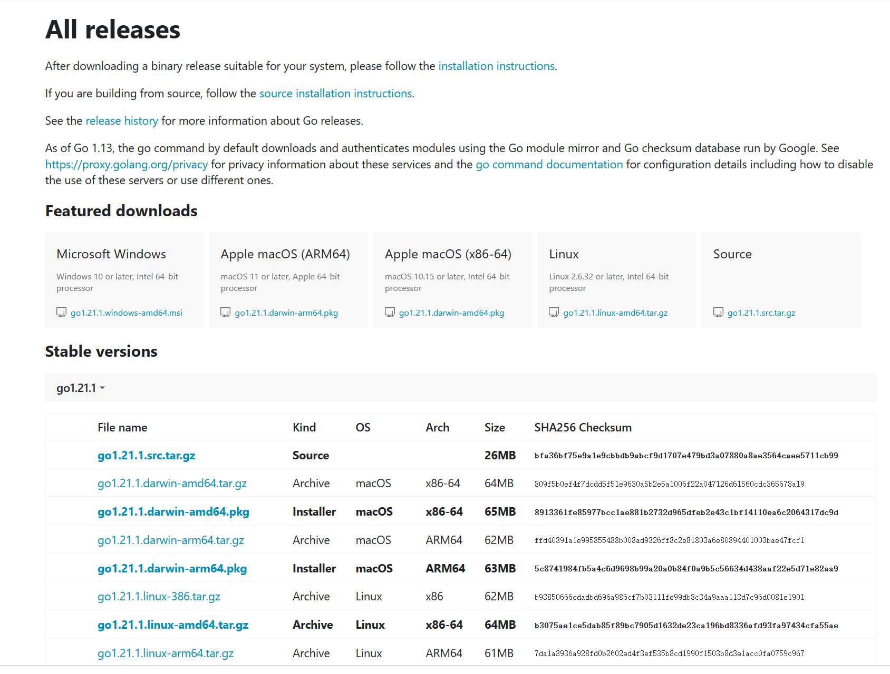
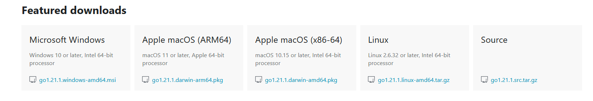
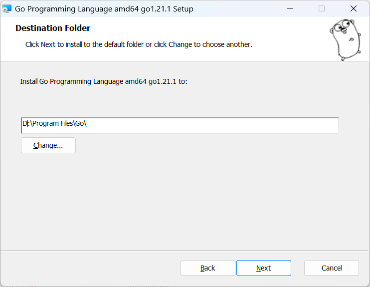
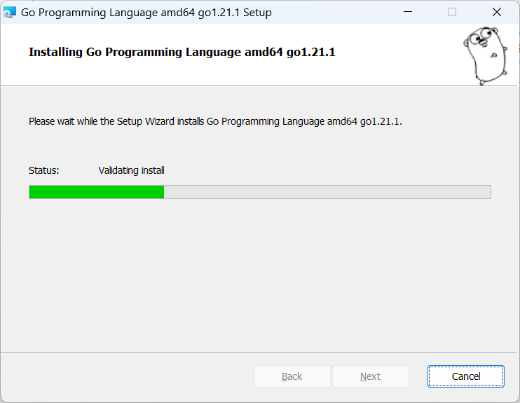
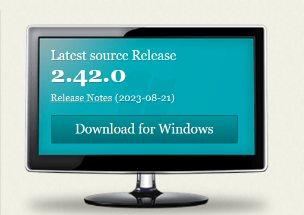

[toc]

---


# 概述

DBA或开发人员，有时会误删或者误更新数据，如果是线上环境并且影响较大，就需要能快速回滚。传统恢复方法是利用备份重搭实例，再应用去除错误sql后的binlog来恢复数据。此法费时费力，甚至需要停机维护，并不适合快速回滚。也有团队利用LVM快照来缩短恢复时间，但快照的缺点是会影响mysql的性能。

可以通过解析MySQL的binlog来生成反向SQL来实现数据回滚


# binlog

## 概述

Mysql的Binlog是二进制格式的日志文件，Binlog是用来记录Mysql内部对数据库的改动（只记录对数据的修改操作），主要用于数据库的主从复制以及增量恢复

binlog 是 MySQL 的逻辑日志，由 Server 层记录，使用任何存储引擎都会记录binlog日志


## 作用

MySQL的作用类似于Oracle的归档日志，可以用来查看数据库的变更历史（具体的时间点所有的SQL操作）、数据库增量备份和恢复（增量备份和基于时间点的恢复）、Mysql的复制（主主数据库的复制、主从数据库的复制）

binlog 通过追加的方式写入，可以通过 `max_binlog_size` 参数配置binlog文件的大小，当文件大小达到给定的定值后，会生成新的文件来保存日志


可以使用阿里巴巴的Canal中间件来实现binLog日志监听


## 刷盘机制

对于 InnoDB 存储引擎，在事务提交后，才会记录 binlog 日志，此时日志在内存中，通过参数 sync_binlog 控制刷盘时间，sync_binlog 值有以下几种：

- 0：事务提交，不刷盘，由操作系统自行判断何时写入磁盘
- 1：每次事务提交的时候，都将 binlog 写入磁盘
- N：每 N 个事务提交，才会将 binlog 写入磁盘


## 开启binlog

首先查看mysql是否开启binlog同步功能

```sql
show variables like 'log_bin';
```


如果为on，则为开启，默认是关闭的

如果没有开启，就要编辑mysql的配置文件`my.cnf`，linux一般是在etc目录下

```sh
vi /etc/my.cnf
```


```sh
# 开启binlog
log-bin = mysql-bin
```


也可以通过 `SET SQL_LOG_BIN=1` 命令来启用 binlog，通过 `SET SQL_LOG_BIN=0` 命令停用 binlog

重启MySQL才能生效


## 相关常用命令

### 是否启用binlog日志

```sql
show variables like 'log_bin';
```


### 查看详细的binlog日志配置信息

```sql
show global variables like '%log%';
```


```sh
mysql> show global variables like '%log%';
+------------------------------------------------+----------------------------------------------------------------+
| Variable_name                                  | Value                                                          |
+------------------------------------------------+----------------------------------------------------------------+
| activate_all_roles_on_login                    | OFF                                                            |
| back_log                                       | 151                                                            |
| binlog_cache_size                              | 32768                                                          |
| binlog_checksum                                | CRC32                                                          |
| binlog_direct_non_transactional_updates        | OFF                                                            |
| binlog_encryption                              | OFF                                                            |
| binlog_error_action                            | ABORT_SERVER                                                   |
| binlog_expire_logs_auto_purge                  | ON                                                             |
| binlog_expire_logs_seconds                     | 2592000                                                        |
| binlog_format                                  | ROW                                                            |
| binlog_group_commit_sync_delay                 | 0                                                              |
| binlog_group_commit_sync_no_delay_count        | 0                                                              |
| binlog_gtid_simple_recovery                    | ON                                                             |
| binlog_max_flush_queue_time                    | 0                                                              |
| binlog_order_commits                           | ON                                                             |
| binlog_rotate_encryption_master_key_at_startup | OFF                                                            |
| binlog_row_event_max_size                      | 8192                                                           |
| binlog_row_image                               | FULL                                                           |
| binlog_row_metadata                            | MINIMAL                                                        |
| binlog_row_value_options                       |                                                                |
| binlog_rows_query_log_events                   | OFF                                                            |
| binlog_stmt_cache_size                         | 32768                                                          |
| binlog_transaction_compression                 | OFF                                                            |
| binlog_transaction_compression_level_zstd      | 3                                                              |
| binlog_transaction_dependency_history_size     | 25000                                                          |
| binlog_transaction_dependency_tracking         | COMMIT_ORDER                                                   |
| expire_logs_days                               | 0                                                              |
| general_log                                    | OFF                                                            |
| general_log_file                               | MAO.log                                                        |
| innodb_api_enable_binlog                       | OFF                                                            |
| innodb_flush_log_at_timeout                    | 1                                                              |
| innodb_flush_log_at_trx_commit                 | 1                                                              |
| innodb_log_buffer_size                         | 16777216                                                       |
| innodb_log_checksums                           | ON                                                             |
| innodb_log_compressed_pages                    | ON                                                             |
| innodb_log_file_size                           | 50331648                                                       |
| innodb_log_files_in_group                      | 2                                                              |
| innodb_log_group_home_dir                      | .\                                                             |
| innodb_log_spin_cpu_abs_lwm                    | 80                                                             |
| innodb_log_spin_cpu_pct_hwm                    | 50                                                             |
| innodb_log_wait_for_flush_spin_hwm             | 400                                                            |
| innodb_log_write_ahead_size                    | 8192                                                           |
| innodb_log_writer_threads                      | ON                                                             |
| innodb_max_undo_log_size                       | 1073741824                                                     |
| innodb_online_alter_log_max_size               | 134217728                                                      |
| innodb_print_ddl_logs                          | OFF                                                            |
| innodb_redo_log_archive_dirs                   |                                                                |
| innodb_redo_log_capacity                       | 104857600                                                      |
| innodb_redo_log_encrypt                        | OFF                                                            |
| innodb_undo_log_encrypt                        | OFF                                                            |
| innodb_undo_log_truncate                       | ON                                                             |
| log_bin                                        | ON                                                             |
| log_bin_basename                               | C:\ProgramData\MySQL\MySQL Server 8.0\Data\MAO-bin             |
| log_bin_index                                  | C:\ProgramData\MySQL\MySQL Server 8.0\Data\MAO-bin.index       |
| log_bin_trust_function_creators                | OFF                                                            |
| log_bin_use_v1_row_events                      | OFF                                                            |
| log_error                                      | .\MAO.err                                                      |
| log_error_services                             | log_filter_internal; log_sink_internal                         |
| log_error_suppression_list                     |                                                                |
| log_error_verbosity                            | 2                                                              |
| log_output                                     | FILE                                                           |
| log_queries_not_using_indexes                  | OFF                                                            |
| log_raw                                        | OFF                                                            |
| log_replica_updates                            | ON                                                             |
| log_slave_updates                              | ON                                                             |
| log_slow_admin_statements                      | OFF                                                            |
| log_slow_extra                                 | OFF                                                            |
| log_slow_replica_statements                    | OFF                                                            |
| log_slow_slave_statements                      | OFF                                                            |
| log_statements_unsafe_for_binlog               | ON                                                             |
| log_throttle_queries_not_using_indexes         | 0                                                              |
| log_timestamps                                 | UTC                                                            |
| max_binlog_cache_size                          | 18446744073709547520                                           |
| max_binlog_size                                | 1073741824                                                     |
| max_binlog_stmt_cache_size                     | 18446744073709547520                                           |
| max_relay_log_size                             | 0                                                              |
| relay_log                                      | mao-relay-bin                                                  |
| relay_log_basename                             | C:\ProgramData\MySQL\MySQL Server 8.0\Data\mao-relay-bin       |
| relay_log_index                                | C:\ProgramData\MySQL\MySQL Server 8.0\Data\mao-relay-bin.index |
| relay_log_info_file                            | relay-log.info                                                 |
| relay_log_info_repository                      | TABLE                                                          |
| relay_log_purge                                | ON                                                             |
| relay_log_recovery                             | OFF                                                            |
| relay_log_space_limit                          | 0                                                              |
| slow_query_log                                 | ON                                                             |
| slow_query_log_file                            | MAO-slow.log                                                   |
| sql_log_off                                    | OFF                                                            |
| sync_binlog                                    | 1                                                              |
| sync_relay_log                                 | 10000                                                          |
| sync_relay_log_info                            | 10000                                                          |
| terminology_use_previous                       | NONE                                                           |
+------------------------------------------------+----------------------------------------------------------------+
91 rows in set, 1 warning (0.00 sec)

mysql>
```


### 查看binlog的目录

```sql
show global variables like "%log_bin%";
```


```sh
mysql> show global variables like "%log_bin%";
+---------------------------------+----------------------------------------------------------+
| Variable_name                   | Value                                                    |
+---------------------------------+----------------------------------------------------------+
| log_bin                         | ON                                                       |
| log_bin_basename                | C:\ProgramData\MySQL\MySQL Server 8.0\Data\MAO-bin       |
| log_bin_index                   | C:\ProgramData\MySQL\MySQL Server 8.0\Data\MAO-bin.index |
| log_bin_trust_function_creators | OFF                                                      |
| log_bin_use_v1_row_events       | OFF                                                      |
+---------------------------------+----------------------------------------------------------+
5 rows in set, 1 warning (0.00 sec)

mysql>
```


### 查看binlog文件日志列表

```sql
show binary logs;
```


```sh
mysql> show binary logs;
+----------------+-----------+-----------+
| Log_name       | File_size | Encrypted |
+----------------+-----------+-----------+
| MAO-bin.000650 | 170403208 | No        |
| MAO-bin.000651 |       180 | No        |
| MAO-bin.000652 |       180 | No        |
| MAO-bin.000653 |       180 | No        |
| MAO-bin.000654 |       180 | No        |
| MAO-bin.000655 |       180 | No        |
| MAO-bin.000656 |       368 | No        |
| MAO-bin.000657 |  21002124 | No        |
| MAO-bin.000658 |       180 | No        |
| MAO-bin.000659 |       180 | No        |
| MAO-bin.000660 |   7909038 | No        |
| MAO-bin.000661 |  25635575 | No        |
| MAO-bin.000662 |   1839935 | No        |
| MAO-bin.000663 |     13990 | No        |
| MAO-bin.000664 | 914604165 | No        |
+----------------+-----------+-----------+
15 rows in set (0.03 sec)

mysql>
```


###  查看最新一个binlog日志文件名称和Position

```sql
show master status;
```


```sh
mysql> show master status;
+----------------+-----------+--------------+------------------+-------------------+
| File           | Position  | Binlog_Do_DB | Binlog_Ignore_DB | Executed_Gtid_Set |
+----------------+-----------+--------------+------------------+-------------------+
| MAO-bin.000664 | 914604165 |              |                  |                   |
+----------------+-----------+--------------+------------------+-------------------+
1 row in set (0.00 sec)

mysql>
```


### 刷新log日志

自此刻开始产生一个新编号的binlog日志文件，每当mysqld服务重启时，会自动执行此命令，刷新binlog日志；在mysqldump备份数据时加 -F 选项也会刷新binlog日志

```sql
flush logs;
```


### 查看第一个binlog文件内容

```sql
show binlog events;
```


内容太多，不展示


### 查看具体一个binlog文件的内容

```sql
show binlog events in 'xxx.00000x';
```


### 清空所有binlog日志

```sql
reset master;
```


### 删除slave的中继日志

```sql
reset slave;
```


### 删除指定日期前的日志索引中binlog日志文件

```sql
purge master logs before 'yyyy-MM-dd HH:mm:ss';
```


### 删除指定日志文件

```sql
purge master logs to 'master.000001';
```


## 找到binlog日志

使用`show global variables like '%log%';`命令，根据`log_bin_basename`参数的值来寻找binlog日志的位置

```sh
PS C:\ProgramData\MySQL\MySQL Server 8.0\Data> pwd

Path
----
C:\ProgramData\MySQL\MySQL Server 8.0\Data


PS C:\ProgramData\MySQL\MySQL Server 8.0\Data> ls


    目录: C:\ProgramData\MySQL\MySQL Server 8.0\Data


Mode                 LastWriteTime         Length Name
----                 -------------         ------ ----
d-----         2023/9/28      9:04                #innodb_redo
d-----         2023/9/26     22:25                #innodb_temp
d-----          2023/9/9     21:11                activiti
d-----         2023/2/14     22:48                aggregate_pay_log
d-----         2023/2/14     22:48                aggregate_pay_merchant_service
d-----         2023/5/19     23:13                aggregate_pay_merchant_service1
d-----         2023/2/14     22:48                aggregate_pay_transaction
d-----         2023/5/19     23:13                aggregate_pay_transaction1
d-----         2023/2/14     22:48                aggregate_pay_uaa
d-----         2023/2/14     22:48                aggregate_pay_user
d-----         2023/5/19     20:08                authority
d-----         2023/4/13     13:13                chat_room
d-----         2023/2/14     22:48                cloud_order
d-----         2023/2/14     22:48                cloud_user
d-----         2023/9/11     14:54                datart
d-----         2023/4/14     21:10                epms
d-----         2023/9/28      8:59                gzepi
d-----         2023/9/28     17:34                gzepi_wdst
d-----         2023/2/14     22:48                hotel
d-----         2023/8/28     10:26                jxstar_cloud
d-----         2023/8/28     13:09                jxstar_cloud1
d-----         2023/4/19     20:38                library_seat_selection
d-----         2023/2/15     22:07                mysql
d-----          2023/5/3     23:49                nacos
d-----         2023/2/15     22:07                performance_schema
d-----         2023/2/14     22:48                sakila
d-----         2023/2/14     22:48                seata
d-----         2023/2/14     22:48                seata_demo
d-----          2023/5/3     23:56                shop
d-----         2023/5/20     21:32                sms
d-----         2023/5/20     21:34                sms1
d-----         2023/2/14     22:48                spring_cloud_security
d-----         2023/2/26     14:46                ssmf51qm
d-----         2023/2/14     22:48                student
d-----          2023/5/3     23:57                student1
d-----         2023/2/14     22:48                student_test
d-----         2023/2/14     22:48                sys
d-----          2023/4/9     23:37                test
d-----          2023/9/6     15:04                test2
d-----          2023/9/5     10:07                test3
d-----          2023/5/8     22:24                tmalldemodb
d-----         2023/2/14     22:48                tx
d-----         2023/2/14     22:48                world
-a----         2023/9/29     19:48         196608 #ib_16384_0.dblwr
-a----         2023/9/28      9:04        8585216 #ib_16384_1.dblwr
-a----        2021/11/24     16:56             56 auto.cnf
-a----        2021/11/24     16:56           1680 ca-key.pem
-a----        2021/11/24     16:56           1112 ca.pem
-a----        2021/11/24     16:56           1112 client-cert.pem
-a----        2021/11/24     16:56           1680 client-key.pem
-a----         2023/9/29     19:46       12582912 ibdata1
-a----         2023/9/26     22:26       12582912 ibtmp1
-a----         2023/9/26     22:24           5916 ib_buffer_pool
-a----         2023/8/29      8:50      170403208 MAO-bin.000650
-a----         2023/8/30     16:25            180 MAO-bin.000651
-a----         2023/8/30     19:53            180 MAO-bin.000652
-a----         2023/8/30     19:55            180 MAO-bin.000653
-a----         2023/8/30     19:57            180 MAO-bin.000654
-a----          2023/9/5      8:54            180 MAO-bin.000655
-a----          2023/9/5     16:38            368 MAO-bin.000656
-a----         2023/9/13     17:42       21002124 MAO-bin.000657
-a----         2023/9/14      9:01            180 MAO-bin.000658
-a----         2023/9/14      9:04            180 MAO-bin.000659
-a----         2023/9/14     15:13        7909038 MAO-bin.000660
-a----         2023/9/15     21:18       25635575 MAO-bin.000661
-a----         2023/9/17     16:33        1839935 MAO-bin.000662
-a----         2023/9/26     22:24          13990 MAO-bin.000663
-a----         2023/9/28     17:34      914604165 MAO-bin.000664
-a----         2023/9/26     22:25            255 MAO-bin.index
-a----         2023/9/26     22:25         131062 MAO-slow.log
-a----         2023/9/28     17:09        1346649 MAO.err
-a----         2023/9/26     22:25              5 mao.pid
-a----         2023/9/29     19:46       50331648 mysql.ibd
-a----         2023/2/15     22:07              6 mysql_upgrade_info
-a----        2021/11/24     16:56           1676 private_key.pem
-a----        2021/11/24     16:56            452 public_key.pem
-a----        2021/11/24     16:56           1112 server-cert.pem
-a----        2021/11/24     16:56           1676 server-key.pem
-a----         2023/9/29     19:43       16777216 undo_001
-a----         2023/9/29     19:48      100663296 undo_002


PS C:\ProgramData\MySQL\MySQL Server 8.0\Data>
```


```sh
PS C:\ProgramData\MySQL\MySQL Server 8.0\Data> cat .\MAO-bin.index
.\MAO-bin.000650
.\MAO-bin.000651
.\MAO-bin.000652
.\MAO-bin.000653
.\MAO-bin.000654
.\MAO-bin.000655
.\MAO-bin.000656
.\MAO-bin.000657
.\MAO-bin.000658
.\MAO-bin.000659
.\MAO-bin.000660
.\MAO-bin.000661
.\MAO-bin.000662
.\MAO-bin.000663
.\MAO-bin.000664
PS C:\ProgramData\MySQL\MySQL Server 8.0\Data>
```


## 解析binlog日志

binlog是二进制文件，普通文件查看器cat more vi等都无法打开，必须使用官方自带的 mysqlbinlog 命令查看


参数如下：

```sh
Usage: C:\Program Files\MySQL\MySQL Server 8.0\bin\mysqlbinlog.exe [options] log-files
  -?, --help          Display this help and exit.
  --base64-output=name
                      Determine when the output statements should be
                      base64-encoded BINLOG statements: 'never' disables it and
                      works only for binlogs without row-based events;
                      'decode-rows' decodes row events into commented
                      pseudo-SQL statements if the --verbose option is also
                      given; 'auto' prints base64 only when necessary (i.e.,
                      for row-based events and format description events).  If
                      no --base64-output[=name] option is given at all, the
                      default is 'auto'.
  --bind-address=name IP address to bind to.
  --character-sets-dir=name
                      Directory for character set files.
  -d, --database=name List entries for just this database (local log only).
  --rewrite-db=name   Rewrite the row event to point so that it can be applied
                      to a new database
  -#, --debug[=#]     This is a non-debug version. Catch this and exit.
  --debug-check       This is a non-debug version. Catch this and exit.
  --debug-info        This is a non-debug version. Catch this and exit.
  --default-auth=name Default authentication client-side plugin to use.
  -D, --disable-log-bin
                      Disable binary log. This is useful, if you enabled
                      --to-last-log and are sending the output to the same
                      MySQL server. This way you could avoid an endless loop.
                      You would also like to use it when restoring after a
                      crash to avoid duplication of the statements you already
                      have. NOTE: you will need a SUPER privilege to use this
                      option.
  -F, --force-if-open Force if binlog was not closed properly.
                      (Defaults to on; use --skip-force-if-open to disable.)
  -f, --force-read    Force reading unknown binlog events.
  -H, --hexdump       Augment output with hexadecimal and ASCII event dump.
  -h, --host=name     Get the binlog from server.
  -i, --idempotent    Notify the server to use idempotent mode before applying
                      Row Events
  -l, --local-load=name
                      Prepare local temporary files for LOAD DATA INFILE in the
                      specified directory.
  -o, --offset=#      Skip the first N entries.
  -p, --password[=name]
                      Password to connect to remote server.
  --plugin-dir=name   Directory for client-side plugins.
  -P, --port=#        Port number to use for connection or 0 for default to, in
                      order of preference, my.cnf, $MYSQL_TCP_PORT,
                      /etc/services, built-in default (3306).
  --protocol=name     The protocol to use for connection (tcp, socket, pipe,
                      memory).
  -R, --read-from-remote-server
                      Read binary logs from a MySQL server. This is an alias
                      for read-from-remote-source=BINLOG-DUMP-NON-GTIDS.
  --read-from-remote-master=name
                      This option is deprecated and will be removed in a future
                      version. Use read-from-remote-source instead.
  --read-from-remote-source=name
                      Read binary logs from a MySQL server through the
                      COM_BINLOG_DUMP or COM_BINLOG_DUMP_GTID commands by
                      setting the option to either BINLOG-DUMP-NON-GTIDS or
                      BINLOG-DUMP-GTIDS, respectively. If
                      --read-from-remote-source=BINLOG-DUMP-GTIDS is combined
                      with --exclude-gtids, transactions are filtered out on
                      the source, to avoid unnecessary network traffic.
  --raw               Requires -R. Output raw binlog data instead of SQL
                      statements, output is to log files.
  -r, --result-file=name
                      Direct output to a given file. With --raw this is a
                      prefix for the file names.
  --server-id=#       Extract only binlog entries created by the server having
                      the given id.
  --server-id-bits=#  Set number of significant bits in server-id
  --set-charset=name  Add 'SET NAMES character_set' to the output.
  --shared-memory-base-name=name
                      Base name of shared memory.
  -s, --short-form    Just show regular queries: no extra info and no row-based
                      events. This is for testing only, and should not be used
                      in production systems. If you want to suppress
                      base64-output, consider using --base64-output=never
                      instead.
  -S, --socket=name   The socket file to use for connection.
  --server-public-key-path=name
                      File path to the server public RSA key in PEM format.
  --get-server-public-key
                      Get server public key
  --ssl-mode=name     SSL connection mode.
  --ssl-ca=name       CA file in PEM format.
  --ssl-capath=name   CA directory.
  --ssl-cert=name     X509 cert in PEM format.
  --ssl-cipher=name   SSL cipher to use.
  --ssl-key=name      X509 key in PEM format.
  --ssl-crl=name      Certificate revocation list.
  --ssl-crlpath=name  Certificate revocation list path.
  --tls-version=name  TLS version to use, permitted values are: TLSv1.2,
                      TLSv1.3
  --ssl-fips-mode=name
                      SSL FIPS mode (applies only for OpenSSL); permitted
                      values are: OFF, ON, STRICT
  --tls-ciphersuites=name
                      TLS v1.3 cipher to use.
  --ssl-session-data=name
                      Session data file to use to enable ssl session reuse
  --ssl-session-data-continue-on-failed-reuse
                      If set to ON, this option will allow connection to
                      succeed even if session data cannot be reused.
  --start-datetime=name
                      Start reading the binlog at first event having a datetime
                      equal or posterior to the argument; the argument must be
                      a date and time in the local time zone, in any format
                      accepted by the MySQL server for DATETIME and TIMESTAMP
                      types, for example: 2004-12-25 11:25:56 (you should
                      probably use quotes for your shell to set it properly).
  -j, --start-position=#
                      Start reading the binlog at position N. Applies to the
                      first binlog passed on the command line.
  --stop-datetime=name
                      Stop reading the binlog at first event having a datetime
                      equal or posterior to the argument; the argument must be
                      a date and time in the local time zone, in any format
                      accepted by the MySQL server for DATETIME and TIMESTAMP
                      types, for example: 2004-12-25 11:25:56 (you should
                      probably use quotes for your shell to set it properly).
  --stop-never        Wait for more data from the server instead of stopping at
                      the end of the last log. Implicitly sets --to-last-log
                      but instead of stopping at the end of the last log it
                      continues to wait till the server disconnects.
  --stop-never-slave-server-id=#
                      The server_id that is reported when connecting to a
                      source server when using --read-from-remote-server
                      --stop-never. This option is deprecated and will be
                      removed in a future version. Use connection-server-id
                      instead.
  --connection-server-id=#
                      The server_id that will be reported when connecting to a
                      source server when using --read-from-remote-server. This
                      option cannot be used together with
                      stop-never-slave-server-id.
  --stop-position=#   Stop reading the binlog at position N. Applies to the
                      last binlog passed on the command line.
  -t, --to-last-log   Requires -R. Will not stop at the end of the requested
                      binlog but rather continue printing until the end of the
                      last binlog of the MySQL server. If you send the output
                      to the same MySQL server, that may lead to an endless
                      loop.
  -u, --user=name     Connect to the remote server as username.
  -v, --verbose       Reconstruct pseudo-SQL statements out of row events. -v
                      -v adds comments on column data types.
  -V, --version       Print version and exit.
  --open-files-limit=#
                      Used to reserve file descriptors for use by this program.
  -c, --verify-binlog-checksum
                      Verify checksum binlog events.
  --binlog-row-event-max-size=#
                      The maximum size of a row-based binary log event in
                      bytes. Rows will be grouped into events smaller than this
                      size if possible. This value must be a multiple of 256.
  --skip-gtids        Do not preserve Global Transaction Identifiers; instead
                      make the server execute the transactions as if they were
                      new.
  --include-gtids=name
                      Print events whose Global Transaction Identifiers were
                      provided.
  --exclude-gtids=name
                      Print all events but those whose Global Transaction
                      Identifiers were provided.
  --print-table-metadata
                      Print metadata stored in Table_map_log_event
  -C, --compress      Use compression in server/client protocol.
  --compression-algorithms=name
                      Use compression algorithm in server/client protocol.
                      Valid values are any combination of
                      'zstd','zlib','uncompressed'.
  --zstd-compression-level=#
                      Use this compression level in the client/server protocol,
                      in case --compression-algorithms=zstd. Valid range is
                      between 1 and 22, inclusive. Default is 3.
  --require-row-format
                      Fail when printing an event that was not logged using row
                      format or other forbidden events like Load instructions
                      or the creation/deletion of temporary tables.

Default options are read from the following files in the given order:
C:\Windows\my.ini C:\Windows\my.cnf C:\my.ini C:\my.cnf C:\Program Files\MySQL\MySQL Server 8.0\my.ini C:\Program Files\MySQL\MySQL Server 8.0\my.cnf
The following groups are read: mysqlbinlog client
The following options may be given as the first argument:
--print-defaults        Print the program argument list and exit.
--no-defaults           Don't read default options from any option file,
                        except for login file.
--defaults-file=#       Only read default options from the given file #.
--defaults-extra-file=# Read this file after the global files are read.
--defaults-group-suffix=#
                        Also read groups with concat(group, suffix)
--login-path=#          Read this path from the login file.
```


命令：

```sh
mysqlbinlog --no-defaults --base64-output=DECODE-ROWS -v ./MAO-bin.000664 >000664.txt
```


备份内容参考：

```sh
### INSERT INTO `test`.`test`
### SET
###   @1=1 /* INT meta=0 nullable=0 is_null=0 */
###   @2=501885 /* INT meta=0 nullable=0 is_null=0 */
###   @3='08566691963-88624912351-16662227201-46648573979-64646226163-77505759394-75470094713-41097360717-15161106334-50535565977' /* STRING(480) meta=61152 nullable=0 is_null=0 */
###   @4='63188288836-92351140030-06390587585-66802097351-49282961843' /* STRING(240) meta=65264 nullable=0 is_null=0 */
### INSERT INTO `test`.`test`
### SET
###   @1=2 /* INT meta=0 nullable=0 is_null=0 */
###   @2=495688 /* INT meta=0 nullable=0 is_null=0 */
###   @3='95969429576-20587925969-20202408199-67602281819-18293380360-38184587501-73192830026-41693404212-56705243222-89212376805' /* STRING(480) meta=61152 nullable=0 is_null=0 */
###   @4='09512147864-77936258834-40901700703-13541171421-15205431759' /* STRING(240) meta=65264 nullable=0 is_null=0 */
### INSERT INTO `test`.`test`
### SET
###   @1=3 /* INT meta=0 nullable=0 is_null=0 */
###   @2=514246 /* INT meta=0 nullable=0 is_null=0 */
###   @3='26283585383-48610978532-72166636310-67148386979-89643583984-06169170732-23477134062-17788128188-73465768032-24619558652' /* STRING(480) meta=61152 nullable=0 is_null=0 */
###   @4='21979564480-87492594656-60524686334-78820761788-57684966682' /* STRING(240) meta=65264 nullable=0 is_null=0 */
### INSERT INTO `test`.`test`
### SET
###   @1=4 /* INT meta=0 nullable=0 is_null=0 */
###   @2=393975 /* INT meta=0 nullable=0 is_null=0 */
###   @3='57481185690-89398636500-16888148413-67987678267-15604944838-94210794401-18107184012-91338377776-83386272438-09451188763' /* STRING(480) meta=61152 nullable=0 is_null=0 */
###   @4='35227182905-15234265621-59793845249-15413569710-23749555118' /* STRING(240) meta=65264 nullable=0 is_null=0 */
### INSERT INTO `test`.`test`
### SET
###   @1=5 /* INT meta=0 nullable=0 is_null=0 */
###   @2=500775 /* INT meta=0 nullable=0 is_null=0 */
###   @3='93482034638-51911042233-95872637268-17943401357-38175578085-45788017606-44041118775-54344399763-72128807465-92228972632' /* STRING(480) meta=61152 nullable=0 is_null=0 */
###   @4='27590239742-20204899609-34345212327-79811525340-24267764271' /* STRING(240) meta=65264 nullable=0 is_null=0 */
### INSERT INTO `test`.`test`
### SET
###   @1=6 /* INT meta=0 nullable=0 is_null=0 */
###   @2=498573 /* INT meta=0 nullable=0 is_null=0 */
###   @3='24310225777-93998284033-46606859421-56148834010-17759122961-78348472702-44986564036-71625391482-12661762212-64721022134' /* STRING(480) meta=61152 nullable=0 is_null=0 */
###   @4='43131080328-59298106536-35954612339-97546855884-75769514803' /* STRING(240) meta=65264 nullable=0 is_null=0 */
### INSERT INTO `test`.`test`
### SET
###   @1=7 /* INT meta=0 nullable=0 is_null=0 */
###   @2=504353 /* INT meta=0 nullable=0 is_null=0 */
###   @3='70862277183-86122137003-79729847560-50337161750-15964469011-48879357028-22541966759-10928901419-99400098250-19200948263' /* STRING(480) meta=61152 nullable=0 is_null=0 */
###   @4='00505722282-72931248925-57037623248-81117963809-88658076981' /* STRING(240) meta=65264 nullable=0 is_null=0 */
### INSERT INTO `test`.`test`
### SET
###   @1=8 /* INT meta=0 nullable=0 is_null=0 */
###   @2=497896 /* INT meta=0 nullable=0 is_null=0 */
###   @3='82571936845-31830426410-85662298479-28456275464-64339136268-26186841165-94168712814-56389105006-66969794071-60071049942' /* STRING(480) meta=61152 nullable=0 is_null=0 */
###   @4='13152283289-69561545685-52868757241-04245213425-69280254356' /* STRING(240) meta=65264 nullable=0 is_null=0 */
### INSERT INTO `test`.`test`
### SET
###   @1=9 /* INT meta=0 nullable=0 is_null=0 */
###   @2=503666 /* INT meta=0 nullable=0 is_null=0 */
###   @3='30259457399-49455699717-43210898264-46300466148-34254750860-44098710066-38295952016-90196077385-22332519290-06484158548' /* STRING(480) meta=61152 nullable=0 is_null=0 */
###   @4='40929980986-33813039690-13155419391-97985458477-39771362212' /* STRING(240) meta=65264 nullable=0 is_null=0 */
### INSERT INTO `test`.`test`
### SET
###   @1=10 /* INT meta=0 nullable=0 is_null=0 */
###   @2=503330 /* INT meta=0 nullable=0 is_null=0 */
###   @3='48090103407-09222928184-34050945574-85418069333-36966673537-23363106719-15284068881-04674238815-26203696337-24037044694' /* STRING(480) meta=61152 nullable=0 is_null=0 */
###   @4='01495266405-82925129145-92643983850-90243995398-18709399387' /* STRING(240) meta=65264 nullable=0 is_null=0 */
```


## 格式

binlog 有三种格式，分为 STATEMENT，ROW 和 MIXED：

* **statement**：基于SQL语句的模式，binlog数据量小，但是某些语句和函数在复制过程可能导致数据不一致甚至出错
* **row**：基于行的模式，记录的是行的完整变化。很安全，但是binlog会比其他两种模式大很多
* **mixed**：混合模式，根据语句来选用是statement还是row模式


### statement

Statement 模式只记录执行的 SQL，不需要记录每一行数据的变化，因此极大的减少了 binlog 的日志量，避免了大量的 IO 操作，提升了系统的性能

但是，正是由于 Statement 模式只记录 SQL，而如果一些 SQL 中 包含了函数，那么可能会出现执行结果不一致的情况。比如说 uuid() 函数，每次执行的时候都会生成一个随机字符串，在 master 中记录了 uuid，当同步到 slave 之后，再次执行，就得到另外一个结果了

所以使用 Statement 格式会出现一些数据一致性问题


### row

从 MySQL5.1.5 版本开始，binlog 引入了 Row 格式

Row 格式的日志内容会非常清楚地记录下每一行数据修改的细节，这样就不会出现 Statement 中存在的那种数据无法被正常复制的情况


### mixed

从 MySQL5.1.8 版开始，MySQL 又推出了 Mixed 格式，这种格式实际上就是 Statement 与 Row 的结合

在 Mixed 模式下，系统会自动判断该用 Statement 还是 Row

Mixed 模式中，MySQL 会根据执行的每一条具体的 SQL 语句来区别对待记录的日志格式，也就是在 Statement 和 Row 之间选择一种

一般的语句修改使用 Statement 格式保存 binlog；对于一些 Statement 无法准确完成主从复制的操作，则采用 Row 格式保存 binlog


### statement优缺点

- 优点：不需要记录每一行的变化，减少了 binlog 日志量，节约IO，从而提高性能。
- 缺点：在某些情况下会导致主从数据不一致，比如执行 sysdate()，slepp()


### row优缺点

- 优点：不会出现某些特定情况下的存储过程、或function、或trigger的调用和触发无法被正确复制的问题
- 缺点：会产生大量的日志


## binlog_row_image

binlog_row_image是一个很重要但又容易被忽略的参数。binlog_row_image参数，决定了binlog是如何记录前镜像和后镜像的，这也就会直接影响到数据闪回、主从复制等

binlog_row_image参数，只在row模式下生效


### 前镜像和后镜像

* 前镜像(before image)：记录修改前的内容
* 后镜像(after image)：记录修改后的内容


### 取值

它有三个取值：`FULL`、`MINIMAL`和`NOBLOB`，默认取值是`FULL`

* binlog_row_image为`FULL`时，表无论有没有主键约束或者唯一约束binlog都会记录所有前后镜像
* binlog_row_image为`MINIMAL`时，如果表有主键或唯一索引，前镜像只保留主键列，后镜像只保留修改列；如果表没有主键或唯一索引，前镜像全保留，后镜像只保留修改列
* binlog_row_image为NOBLOB时，如果表有主键或唯一索引，修改列为text/blob列，前镜像忽略text/blob列，后镜像包含被修改的text/blob列；如果表有主键或唯一索引，修改列不是text/blob列，前后镜像忽略text/blob列。如果表没有主键或唯一索引，修改列为text/blob列 ，前后镜像全保留；如果表没有主键或唯一索引，修改列不是text/blob列，前镜像全保留，后镜像忽略text/blob列


### binlog的区别

三者取值不同，binlog会有一定的区别


#### FULL

##### 有主键约束

```sql
CREATE TABLE 'test1' (
    'id' int(11) NOT NULL,
    'name' varchar(10) DEFAULT NULL,
    primary key('id')
);

INSERT into test1 values(1,'jack'),(2,'mary');

UPDATE test1 SET name='bob' WHERE id=2;
```


使用mysqlbinlog解析binlog，得到的记录镜像信息如下：

```sh
### UPDATE 'test1','test1'
### WHERE
###	  @1=2
###   @2='mary'
### SET
###   @1=2
###   @2='bob'
```


更新记录的前后镜像所有字段都记录了


##### 无主键约束

```sql
CREATE TABLE 'test2' (
	'id' int(11) DEFAULT NULL,
    'name' varchar(10) DEFAULT NULL
);

INSERT into test2 values(1,'bob'),(2,'chang');

UPDATE test2 SET name='jack' WHERE id=2;
```


```sh
### UPDATE 'test','test2'
### WHERE
###	  @1=2
###   @2='chang'
### SET
###   @1=2
###   @2='jack'
```


更新记录的前后镜像所有字段都记录了


#### MINIMAL

##### 有主键约束

```sql
CREATE TABLE 'test1' (
    'id' int(11) NOT NULL,
    'name' varchar(10) DEFAULT NULL,
    primary key('id')
);

INSERT into test1 values(1,'jack'),(2,'mary');

UPDATE test1 SET name='bob' WHERE id=2;
```


```sh
### UPDATE 'test','test1'
### WHERE
###	  @1=2
### SET
###   @2='bob'
```


如果表有主键或唯一索引，前镜像只保留主键列，后镜像只保留修改列


##### 无主键约束

```sql
CREATE TABLE 'test2' (
	'id' int(11) DEFAULT NULL,
    'name' varchar(10) DEFAULT NULL
);

INSERT into test2 values(1,'bob'),(2,'chang');

UPDATE test2 SET name='jack' WHERE id=2;
```


```sh
### UPDATE 'test','test2'
### WHERE
###	  @1=1
###   @2='chang'
### SET
###   @2='jack'
```


如果表没有主键或唯一索引，前镜像全保留，后镜像只保留修改列


#### NOBLOB

##### 有主键约束并更新text/blob列

```sql
CREATE TABLE 'test1' (
    'id' int(11) NOT NULL,
    'name' text,
    'address' varchar(20) DEFAULT NULL,
    PRIMARY kEY ('id')
);

INSERT into test1 values(1,'jack','Japen'),(2,'bob','China');

UPDATE test1 SET name='mary' WHERE id=1;
```


```sh
### UPDATE 'test','test1'
### WHERE
###	  @1=1
###   @3='Japen'
### SET
###   @1=1
###   @2='mary'
###   @3='Japen'
```


如果表有主键或唯一索引，修改列为text/blob列，前镜像忽略text/blob列，后镜像包含被修改的text/blob列


##### 有主键约束并更新非text/blob列

```sql
UPDATE test1 SET address='Japen2' WHERE id=1;
```


```sh
### UPDATE 'test','test1'
### WHERE
###	  @1=1
###   @3='Japen'
### SET
###   @1=1
###   @3='Japen2'
```


如果表没有主键或唯一索引，修改的列不是text/blob列，则前后镜像都忽略text/blob列


##### 无主键约束并更新text/blob列

```sql
CREATE TABLE 'test2' (
    'id' int(11) NOT NULL,
    'name' text DEFAULT NULL,
    'address' varchar(20) DEFAULT NULL
);

INSERT into test2 values(1,'jack','Japen'),(2,'bob','China');

UPDATE test2 SET name='mary' WHERE id=1;
```


```sh
### UPDATE 'test','test1'
### WHERE
###	  @1=1
###   @2='jack'
###   @3='Japen'
### SET
###   @1=1
###   @2='mary'
###   @3='Japen'
```


如果表没有主键或唯一索引，修改列为text/blob列，前后镜像全都保留


##### 无主键约束并更新非text/blob列

```sql
UPDATE test2 SET address='Japen2' WHERE id=1;
```


```sh
### UPDATE 'test','test2'
### WHERE
###	  @1=1
###   @2='mary'
###   @3='Japen'
### SET
###   @1=1
###   @3='Japen2'
```


如果表没有主键或唯一索引，修改列不是text/blob列，则前镜像全保留，后镜像忽略text/blob列


# 数据闪回

## 概述

闪回技术是一种在数据库中进行异常数据恢复的高级技术，它可以将数据库还原到之前的某个时间点，从而消除误操作、错误数据或系统故障所引起的问题。闪回技术不仅简单易用，而且具有高效性和可靠性，成为数据库管理员（DBA）的得力助手

如果在Oracle中误删除了数据，特定场景下可以通过闪回，进行数据的恢复，操作上是比较直观的，而且有很多粒度，例如闪回查询、闪回表、闪回事务、闪回数据库

MySQL中同样支持闪回，但是和Oracle略有区别

MySQL中，binlog文件主要用于主从同步二进制数据日志。当主服务器数据发生变更时，会把变动明细持久化到binlog文件中，此时从服务器通过拉取并解析binlog文件，实现数据的同步。正是由于binlog文件中记录了数据变更的信息，因此MySQL的闪回是基于binlog文件来实现的


## 要求

如果要在MySQL中实现闪回，则必须要求binlog文件日志格式是`binlog_format=row`，并且`binlog_row_image=full`。通过指定binlog文件的日志格式，就能在binlog中完整记录数据变化的轨迹和具体的操作行为（增删改）的前后差异。


## 原理

基于上述前提，我们可以解析并处理binlog文件中的事件，然后反序遍历。同时对增删改进行反转逆操作，即插入映射成删除、删除映射成插入、更新交换新旧数据区间。最后输出对应数据回滚的binlog文件，将其再次导入mysql，即完成对增删改数据的回滚还原


对于delete操作，我们从binlog提取出delete信息，生成的回滚语句是insert：

```sql
原始：DELETE FROM `test`.`user` WHERE `id`=1 AND `name`='小赵';
回滚：INSERT INTO `test`.`user`(`id`, `name`) VALUES (1, '小赵');
```


对于insert操作，回滚SQL是delete：

```sql
原始：INSERT INTO `test`.`user`(`id`, `name`) VALUES (2, '小钱');
回滚：DELETE FROM `test`.`user` WHERE `id`=2 AND `name`='小钱';
```


对于update操作，回滚sql应该交换SET和WHERE的值：

```sql
原始：UPDATE `test`.`user` SET `id`=3, `name`='小李' WHERE `id`=3 AND `name`='小孙';
回滚：UPDATE `test`.`user` SET `id`=3, `name`='小孙' WHERE `id`=3 AND `name`='小李';
```


## 局限性

* binlog_format=row
* binlog_row_image=full
* 只能支持DML语句(增删改)


如果误操作是DDL的话，是无法利用binlog做快速回滚的，因为即使在row模式下，binlog对于DDL操作也不会记录每行数据的变化。要实现DDL快速回滚，必须修改MySQL源码，使得在执行DDL前先备份老数据。目前有多个mysql定制版本实现了DDL闪回特性


## 闪回工具

### 分类

闪回工具按实现方式分成了三类


#### 集成mysqlbinlog

第一类是以patch形式集成到官方工具mysqlbinlog中


**优点：**

* 上手成本低。mysqlbinlog原有的选项都能直接利用，只是多加了一个闪回选项
* 支持离线解析


**缺点：**

* 兼容性差、项目活跃度不高。由于binlog格式的变动，如果闪回工具作者不及时对补丁升级，则闪回工具将无法使用。目前已有多位人员分别针对mysql5.5，5.6，5.7开发了patch，部分项目代码公开，但总体上活跃度都不高
* 难以添加新功能，实战效果欠佳。在实战中，经常会遇到现有patch不满足需求的情况，比如要加个表过滤，很简单的一个需求，代码改动也不会大，但对大部分DBA来说，改mysql源码还是很困难的事
* 安装稍显麻烦。需要对mysql源码打补丁再编译生成


#### 独立工具

第二类是独立工具，通过伪装成slave拉取binlog来进行处理，或者直接解析binlog日志


**优点：**

* 兼容性好。伪装成slave拉binlog这项技术在业界应用的非常广泛，多个开发语言都有这样的活跃项目，MySQL版本的兼容性由这些项目搞定，闪回工具的兼容问题不再突出
* 添加新功能的难度小。更容易被改造成DBA自己喜欢的形式
* 安装和使用简单


**缺点：**

* 必须开启MySQL server，并且连接上MySQL服务，因为仔细观察binlog日志，就会发现，**binlog只是记录的表里的第几个字段被更改成什么值，这时候还并不知道这个字段叫什么名称，需要连接数据库来查询表的元数据信息，第一个字段叫什么名字，第二个字段叫什么名字......所以账号至少要给对应表的读取元数据的权限**


#### 简单脚本

第三类是简单脚本。先用mysqlbinlog解析出文本格式的binlog，再根据回滚原理用正则进行匹配并替换


**优点：**

* 脚本写起来方便，往往能快速搞定某个特定问题
* 安装和使用简单
* 支持离线解析


**缺点：**

* 通用性不好
* 可靠性不好


### 常用工具

* **binlog2sql**：Python 编写，用于生成回滚/前滚 SQL 进行数据恢复/补偿
* **MyFlash**：C 语言编写，用于生成反向 binlog 文件（二进制）进行数据恢复
* **my2sql**：Go 语言编写，除了闪回，还提供了前滚和事务分析的功能


这3个工具都是第二类闪回工具


### 性能对比

|                                                | my2sql  | binlog2sql |
| ---------------------------------------------- | ------- | ---------- |
| 1.1G binlog生成回滚SQL                         | 1分40秒 | 65分钟     |
| 1.1G binlog生成原始SQL                         | 1分30秒 | 50分钟     |
| 1.1G binlog生成表DML统计信息、以及事务统计信息 | 40秒    | 不支持     |


## **闪回大致流程**

1. **误删MySQL某张表的数据**
2. **立即记录当前时间（不记录当前时间也可以，但是要解析整个binlog文件）**
3. **立即使用命令查看当前MySQL服务实例的binlog日志在哪个文件**
4. **连接MySQL所在的Linux服务器，找到对应的目录，拷贝对应的binlog日志文件到本机上，必要时可以拷贝上一个日志文件**
5. **连接MySQL服务，导出表结构，如果不过滤表，那么需要导出所有的表结构，如果指定了表，那么只需要导出对应的表结构就行了**
6. **将导出的表结构放到本地MySQL服务里执行，注意库名和表名必须要和Linux服务器上的一样**
7. **使用第二类闪回工具连接本地MySQL，解析binlog文件，生成回滚SQL**
8. **检查生成的回滚SQL**
9. **将生成的回滚SQL选择性的导入到本地MySQL库里，检查语法是否错误**
10. **再次检查数据的正确性**
11. **从本地库导出对应的SQL，到生产库里执行**


**注意：**

* **大部分独立工具直接伪装成MySQL的从节点来直接实现数据闪回功能，但是在生产环境中并不推荐，有些业务做了读写分离，伪装成slave节点可能会影响业务的正常使用**
* **如果没有拿到Linux的访问权限，或者没有MySQL binlog日志文件的读权限，但是有MySQL比较高的账号权限，那么只能用伪装成slave节点的方式了，或者叫有权限的管理员拷贝**
* **生成的回滚SQL一定要检查一遍，避免出现更大的生产事故**
* **无误删数据时，binlog要及时拷贝出来，过了一段时间binlog日志会被覆盖或者清除**


# my2sql

## 概述

go版MySQL binlog解析工具，通过解析MySQL binlog ，可以生成原始SQL、回滚SQL、去除主键的INSERT SQL等，也可以生成DML统计信息


优点：

* 功能丰富，不仅支持回滚操作，还有其他实用功能
* 基于golang实现，速度快，全量解析1.1G 的binlog日志只需要1分30秒左右，当前其他类似开源工具一般要几十分钟


开源地址：https://github.com/liuhr/my2sql


用途：

- 数据快速回滚(闪回)
- 主从切换后新master丢数据的修复
- 从binlog生成标准SQL，带来的衍生功能
- 生成DML统计信息，可以找到哪些表更新的比较频繁
- IO高TPS高， 查出哪些表在频繁更新
- 找出某个时间点数据库是否有大事务或者长事务
- 主从延迟，分析主库执行的SQL语句
- 除了支持常规数据类型，对大部分工具不支持的数据类型做了支持，比如json、blob、text、emoji等数据类型sql生成


## 环境部署

项目是用go语言写的，需要go语言环境，拉取代码需要git


### go语言环境

#### 介绍

Go（又称 Golang）是 Google 的 Robert Griesemer，Rob Pike 及 Ken Thompson 开发的一种静态强类型、编译型语言。Go 语言语法与 C 相近，但功能上有：

* **内存安全**：将一切并发化固然是好，但带来的问题同样很多。如何实现高并发下的内存分配和管理就是个难题。好在 Go 选择了 tcmalloc，它本就是为并发而设计的高性能内存分配组件。内存分配器是运行时三大组件里变化最少的部分。刨去因配合垃圾回收器而修改的内容，内存分配器完整保留了 tcmalloc 的原始架构。使用 cache 为当前执行线程提供无锁分配，多个 central 在不同线程间平衡内存单元复用。在更高层次里，heap 则管理着大块内存，用以切分成不同等级的复用内存块。快速分配和二级内存平衡机制，让内存分配器能优秀地完成高压力下的内存管理任务。在最近几个版本中，编译器优化卓有成效。它会竭力将对象分配在栈上，以降低垃圾回收压力，减少管理消耗，提升执行性能。
* **GC（垃圾回收）**：垃圾回收一直是个难题。早年间，Java 就因垃圾回收低效被嘲笑了许久，后来 Sun 连续收纳了好多人和技术才发展到今天。可即便如此，在 Hadoop 等大内存应用场景下，垃圾回收依旧捉襟见肘、步履维艰。相比 Java，Go 面临的困难要更多。因指针的存在，所以回收内存不能做收缩处理。幸好，指针运算被阻止，否则要做到精确回收都难。每次升级，垃圾回收器必然是核心组件里修改最多的部分。从并发清理，到降低 STW 时间，直到 Go 的 1.5 版本实现并发标记，逐步引入三色标记和写屏障等等，都是为了能让垃圾回收在不影响用户逻辑的情况下更好地工作。尽管有了努力，当前版本的垃圾回收算法也只能说堪用，离好用尚有不少距离。
* **结构形态**：Go 刚发布时，静态链接被当作优点宣传。只须编译后的一个可执行文件，无须附加任何东西就能部署。这似乎很不错，只是后来风气变了。连着几个版本，编译器都在完善动态库 buildmode 功能，场面一时变得有些尴尬。静态编译的好处显而易见。将运行时、依赖库直接打包到可执行文件内部，简化了部署和发布操作，无须事先安装运行环境和下载诸多第三方库。这种简单方式对于编写系统软件有着极大好处，因为库依赖一直都是个麻烦。Go 标准库虽称不得完全覆盖，但也算极为丰富。其中值得称道的是 net/http，仅须简单几条语句就能实现一个高性能 Web Server，这从来都是宣传的亮点。更何况大批基于此的优秀第三方 Framework 更是将 Go 推到 Web/Microservice 开发标准之一的位置。
* **CSP-style 并发计算**：时至今日，并发编程已成为程序员的基本技能，在各个技术社区都能看到诸多与之相关的讨论主题。在这种情况下Go语言却一反常态做了件极大胆的事，从根本上将一切都并发化，运行时用 Goroutine 运行所有的一切，包括 main.main 入口函数。可以说，Goroutine 是 Go 最显著的特征。它用类协程的方式来处理并发单元，却又在运行时层面做了更深度的优化处理。这使得语法上的并发编程变得极为容易，无须处理回调，无须关注线程切换，仅一个关键字，简单而自然。搭配 channel，实现 CSP 模型。将并发单元间的数据耦合拆解开来，各司其职，这对所有纠结于内存共享、锁粒度的开发人员都是一个可期盼的解脱。若说有所不足，那就是应该有个更大的计划，将通信从进程内拓展到进程外，实现真正意义上的分布式。


Go语言是编程语言设计的又一次尝试，是对类C语言的重大改进，它不但能让你访问底层操作系统，还提供了强大的网络编程和并发编程支持。Go语言的用途众多，可以进行网络编程、系统编程、并发编程、分布式编程

Go语言的推出，旨在不损失应用程序性能的情况下降低代码的复杂性，具有“部署简单、并发性好、语言设计良好、执行性能好”等优势，目前国内诸多 IT 公司均已采用Go语言开发项目

Go语言有时候被描述为“C 类似语言”，或者是“21 世纪的C语言”。Go 从C语言继承了相似的表达式语法、控制流结构、基础数据类型、调用参数传值、指针等很多思想，还有C语言一直所看中的编译后机器码的运行效率以及和现有操作系统的无缝适配

因为Go语言没有类和继承的概念，所以它和 Java 或 C++ 看起来并不相同。但是它通过接口（interface）的概念来实现多态性。Go语言有一个清晰易懂的轻量级类型系统，在类型之间也没有层级之说。因此可以说Go语言是一门混合型的语言

此外，很多重要的开源项目都是使用Go语言开发的，其中包括 Docker、Go-Ethereum、Thrraform 和 Kubernetes


Go 使用编译器来编译代码。编译器将源代码编译成二进制（或字节码）格式；在编译代码时，编译器检查错误、优化性能并输出可在不同平台上运行的二进制文件。要创建并运行 Go 程序，程序员必须执行如下步骤：

1. 使用文本编辑器创建 Go 程序
2. 保存文件
3. 编译程序
4. 运行编译得到的可执行文件


Go语言支持交叉编译，比如说你可以在运行 Linux 系统的计算机上开发可以在 Windows 上运行的应用程序


go语言跨平台的，但是生成的可执行文件不是跨平台的


#### 下载

在Go语言[官网](https://golang.google.cn/dl/)下载 Windows 系统下的Go语言开发包


打开官网




选择对应的版本




或者直接下载：

* Windows：https://golang.google.cn/dl/go1.21.1.windows-amd64.msi
* Linux：https://golang.google.cn/dl/go1.21.1.linux-amd64.tar.gz


#### 安装

以Windows为例，双击运行下载好的安装包


选择安装位置




等待安装完成




#### 常用命令

命令如下：

```sh
PS C:\Users\mao> go help
Go is a tool for managing Go source code.

Usage:

        go <command> [arguments]

The commands are:

        bug         start a bug report
        build       compile packages and dependencies
        clean       remove object files and cached files
        doc         show documentation for package or symbol
        env         print Go environment information
        fix         update packages to use new APIs
        fmt         gofmt (reformat) package sources
        generate    generate Go files by processing source
        get         add dependencies to current module and install them
        install     compile and install packages and dependencies
        list        list packages or modules
        mod         module maintenance
        work        workspace maintenance
        run         compile and run Go program
        test        test packages
        tool        run specified go tool
        version     print Go version
        vet         report likely mistakes in packages

Use "go help <command>" for more information about a command.

Additional help topics:

        buildconstraint build constraints
        buildmode       build modes
        c               calling between Go and C
        cache           build and test caching
        environment     environment variables
        filetype        file types
        go.mod          the go.mod file
        gopath          GOPATH environment variable
        gopath-get      legacy GOPATH go get
        goproxy         module proxy protocol
        importpath      import path syntax
        modules         modules, module versions, and more
        module-get      module-aware go get
        module-auth     module authentication using go.sum
        packages        package lists and patterns
        private         configuration for downloading non-public code
        testflag        testing flags
        testfunc        testing functions
        vcs             controlling version control with GOVCS

Use "go help <topic>" for more information about that topic.

PS C:\Users\mao>
```


构建相关(go build)：

```sh
PS C:\Users\mao> go help build
usage: go build [-o output] [build flags] [packages]

Build compiles the packages named by the import paths,
along with their dependencies, but it does not install the results.

If the arguments to build are a list of .go files from a single directory,
build treats them as a list of source files specifying a single package.

When compiling packages, build ignores files that end in '_test.go'.

When compiling a single main package, build writes
the resulting executable to an output file named after
the first source file ('go build ed.go rx.go' writes 'ed' or 'ed.exe')
or the source code directory ('go build unix/sam' writes 'sam' or 'sam.exe').
The '.exe' suffix is added when writing a Windows executable.

When compiling multiple packages or a single non-main package,
build compiles the packages but discards the resulting object,
serving only as a check that the packages can be built.

The -o flag forces build to write the resulting executable or object
to the named output file or directory, instead of the default behavior described
in the last two paragraphs. If the named output is an existing directory or
ends with a slash or backslash, then any resulting executables
will be written to that directory.

The build flags are shared by the build, clean, get, install, list, run,
and test commands:

        -C dir
                Change to dir before running the command.
                Any files named on the command line are interpreted after
                changing directories.
                If used, this flag must be the first one in the command line.
        -a
                force rebuilding of packages that are already up-to-date.
        -n
                print the commands but do not run them.
        -p n
                the number of programs, such as build commands or
                test binaries, that can be run in parallel.
                The default is GOMAXPROCS, normally the number of CPUs available.
        -race
                enable data race detection.
                Supported only on linux/amd64, freebsd/amd64, darwin/amd64, darwin/arm64, windows/amd64,
                linux/ppc64le and linux/arm64 (only for 48-bit VMA).
        -msan
                enable interoperation with memory sanitizer.
                Supported only on linux/amd64, linux/arm64, freebsd/amd64
                and only with Clang/LLVM as the host C compiler.
                PIE build mode will be used on all platforms except linux/amd64.
        -asan
                enable interoperation with address sanitizer.
                Supported only on linux/arm64, linux/amd64.
                Supported only on linux/amd64 or linux/arm64 and only with GCC 7 and higher
                or Clang/LLVM 9 and higher.
        -cover
                enable code coverage instrumentation.
        -covermode set,count,atomic
                set the mode for coverage analysis.
                The default is "set" unless -race is enabled,
                in which case it is "atomic".
                The values:
                set: bool: does this statement run?
                count: int: how many times does this statement run?
                atomic: int: count, but correct in multithreaded tests;
                        significantly more expensive.
                Sets -cover.
        -coverpkg pattern1,pattern2,pattern3
                For a build that targets package 'main' (e.g. building a Go
                executable), apply coverage analysis to each package matching
                the patterns. The default is to apply coverage analysis to
                packages in the main Go module. See 'go help packages' for a
                description of package patterns.  Sets -cover.
        -v
                print the names of packages as they are compiled.
        -work
                print the name of the temporary work directory and
                do not delete it when exiting.
        -x
                print the commands.
        -asmflags '[pattern=]arg list'
                arguments to pass on each go tool asm invocation.
        -buildmode mode
                build mode to use. See 'go help buildmode' for more.
        -buildvcs
                Whether to stamp binaries with version control information
                ("true", "false", or "auto"). By default ("auto"), version control
                information is stamped into a binary if the main package, the main module
                containing it, and the current directory are all in the same repository.
                Use -buildvcs=false to always omit version control information, or
                -buildvcs=true to error out if version control information is available but
                cannot be included due to a missing tool or ambiguous directory structure.
        -compiler name
                name of compiler to use, as in runtime.Compiler (gccgo or gc).
        -gccgoflags '[pattern=]arg list'
                arguments to pass on each gccgo compiler/linker invocation.
        -gcflags '[pattern=]arg list'
                arguments to pass on each go tool compile invocation.
        -installsuffix suffix
                a suffix to use in the name of the package installation directory,
                in order to keep output separate from default builds.
                If using the -race flag, the install suffix is automatically set to race
                or, if set explicitly, has _race appended to it. Likewise for the -msan
                and -asan flags. Using a -buildmode option that requires non-default compile
                flags has a similar effect.
        -ldflags '[pattern=]arg list'
                arguments to pass on each go tool link invocation.
        -linkshared
                build code that will be linked against shared libraries previously
                created with -buildmode=shared.
        -mod mode
                module download mode to use: readonly, vendor, or mod.
                By default, if a vendor directory is present and the go version in go.mod
                is 1.14 or higher, the go command acts as if -mod=vendor were set.
                Otherwise, the go command acts as if -mod=readonly were set.
                See https://golang.org/ref/mod#build-commands for details.
        -modcacherw
                leave newly-created directories in the module cache read-write
                instead of making them read-only.
        -modfile file
                in module aware mode, read (and possibly write) an alternate go.mod
                file instead of the one in the module root directory. A file named
                "go.mod" must still be present in order to determine the module root
                directory, but it is not accessed. When -modfile is specified, an
                alternate go.sum file is also used: its path is derived from the
                -modfile flag by trimming the ".mod" extension and appending ".sum".
        -overlay file
                read a JSON config file that provides an overlay for build operations.
                The file is a JSON struct with a single field, named 'Replace', that
                maps each disk file path (a string) to its backing file path, so that
                a build will run as if the disk file path exists with the contents
                given by the backing file paths, or as if the disk file path does not
                exist if its backing file path is empty. Support for the -overlay flag
                has some limitations: importantly, cgo files included from outside the
                include path must be in the same directory as the Go package they are
                included from, and overlays will not appear when binaries and tests are
                run through go run and go test respectively.
        -pgo file
                specify the file path of a profile for profile-guided optimization (PGO).
                When the special name "auto" is specified, for each main package in the
                build, the go command selects a file named "default.pgo" in the package's
                directory if that file exists, and applies it to the (transitive)
                dependencies of the main package (other packages are not affected).
                Special name "off" turns off PGO. The default is "auto".
        -pkgdir dir
                install and load all packages from dir instead of the usual locations.
                For example, when building with a non-standard configuration,
                use -pkgdir to keep generated packages in a separate location.
        -tags tag,list
                a comma-separated list of additional build tags to consider satisfied
                during the build. For more information about build tags, see
                'go help buildconstraint'. (Earlier versions of Go used a
                space-separated list, and that form is deprecated but still recognized.)
        -trimpath
                remove all file system paths from the resulting executable.
                Instead of absolute file system paths, the recorded file names
                will begin either a module path@version (when using modules),
                or a plain import path (when using the standard library, or GOPATH).
        -toolexec 'cmd args'
                a program to use to invoke toolchain programs like vet and asm.
                For example, instead of running asm, the go command will run
                'cmd args /path/to/asm <arguments for asm>'.
                The TOOLEXEC_IMPORTPATH environment variable will be set,
                matching 'go list -f {{.ImportPath}}' for the package being built.

The -asmflags, -gccgoflags, -gcflags, and -ldflags flags accept a
space-separated list of arguments to pass to an underlying tool
during the build. To embed spaces in an element in the list, surround
it with either single or double quotes. The argument list may be
preceded by a package pattern and an equal sign, which restricts
the use of that argument list to the building of packages matching
that pattern (see 'go help packages' for a description of package
patterns). Without a pattern, the argument list applies only to the
packages named on the command line. The flags may be repeated
with different patterns in order to specify different arguments for
different sets of packages. If a package matches patterns given in
multiple flags, the latest match on the command line wins.
For example, 'go build -gcflags=-S fmt' prints the disassembly
only for package fmt, while 'go build -gcflags=all=-S fmt'
prints the disassembly for fmt and all its dependencies.

For more about specifying packages, see 'go help packages'.
For more about where packages and binaries are installed,
run 'go help gopath'.
For more about calling between Go and C/C++, run 'go help c'.

Note: Build adheres to certain conventions such as those described
by 'go help gopath'. Not all projects can follow these conventions,
however. Installations that have their own conventions or that use
a separate software build system may choose to use lower-level
invocations such as 'go tool compile' and 'go tool link' to avoid
some of the overheads and design decisions of the build tool.

See also: go install, go get, go clean.
PS C:\Users\mao>
```


### git版本控制系统

#### 介绍

Git 是一个免费和开源 的分布式版本控制系统，旨在以速度和效率处理从小型到大型项目的所有内容

Git易于学习，占用空间小，性能快如闪电。它优于 SCM 工具，如 Subversion, CVS, Perforce, 和 ClearCase 具有的本地分支, 方便的暂存区域，和多个工作流等功能

关于git，这里不做过多介绍


#### 下载

官网地址：https://git-scm.com/


点击下载：




或者直接使用以下链接：

* https://git-scm.com/download/win


#### 安装

自行百度


#### 常用命令

```sh
PS C:\Users\mao> git
usage: git [-v | --version] [-h | --help] [-C <path>] [-c <name>=<value>]
           [--exec-path[=<path>]] [--html-path] [--man-path] [--info-path]
           [-p | --paginate | -P | --no-pager] [--no-replace-objects] [--bare]
           [--git-dir=<path>] [--work-tree=<path>] [--namespace=<name>]
           [--super-prefix=<path>] [--config-env=<name>=<envvar>]
           <command> [<args>]

These are common Git commands used in various situations:

start a working area (see also: git help tutorial)
   clone     Clone a repository into a new directory
   init      Create an empty Git repository or reinitialize an existing one

work on the current change (see also: git help everyday)
   add       Add file contents to the index
   mv        Move or rename a file, a directory, or a symlink
   restore   Restore working tree files
   rm        Remove files from the working tree and from the index

examine the history and state (see also: git help revisions)
   bisect    Use binary search to find the commit that introduced a bug
   diff      Show changes between commits, commit and working tree, etc
   grep      Print lines matching a pattern
   log       Show commit logs
   show      Show various types of objects
   status    Show the working tree status

grow, mark and tweak your common history
   branch    List, create, or delete branches
   commit    Record changes to the repository
   merge     Join two or more development histories together
   rebase    Reapply commits on top of another base tip
   reset     Reset current HEAD to the specified state
   switch    Switch branches
   tag       Create, list, delete or verify a tag object signed with GPG

collaborate (see also: git help workflows)
   fetch     Download objects and refs from another repository
   pull      Fetch from and integrate with another repository or a local branch
   push      Update remote refs along with associated objects

'git help -a' and 'git help -g' list available subcommands and some
concept guides. See 'git help <command>' or 'git help <concept>'
to read about a specific subcommand or concept.
See 'git help git' for an overview of the system.
PS C:\Users\mao>
```


克隆：

```sh
git clone <url>
```


常用命令不止这一个，这里只用到了这个命令，常用命令可以自行百度


## 项目部署和编译

### 克隆项目


### 编译项目


## 常用参数


## 示例


## 实战


# binlog2sql

## 概述


## 项目部署和编译

### 克隆项目


### 编译项目


## 常用参数


## 示例


# MyFlash

## 概述


## 环境部署


## 项目部署

### 克隆项目


## 常用参数


## 示例


# 总结

